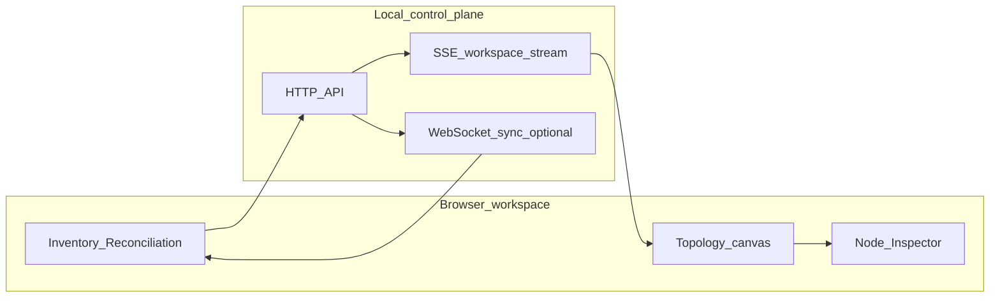

# OmniGraph

**[Glossary](docs/GLOSSARY.md)** — terms and acronyms used below.

**OmniGraph** is a browser workspace that shows **infrastructure as a graph** so intent, topology, pipeline context, inventory, and security posture live in one place instead of scattered across HCL, playbooks, CI YAML, and logs.

**Infrastructure as a visible, declarative graph—not scattered pipeline glue.**

If your stack mixes OpenTofu/Terraform and Ansible, the real deployment story is usually split across HCL, playbooks, CI YAML, and job logs. Teams spend time reconstructing intent, handoffs, and drift from terminal output instead of seeing one trustworthy view. OmniGraph keeps your existing tools, but puts that story on one canvas so teams can reason about changes before and after they run.
**Infrastructure as a visible, declarative graph—not scattered pipeline glue.**

Teams face intense friction when they try to collaborate while reconstructing topology from scattered fragments of Terraform, Ansible, HCL, and YAML CI pipelines. Intent and handoffs live in incompatible places; everyone rebuilds the same mental model from logs and diffs instead of **shared understanding** in one place.

**OmniGraph** is the antidote: a **local Go control plane** (when you use server-backed features) and a **React workspace** in **your browser**—schema-first intent (`.omnigraph.schema` and versioned contracts), an **interactive topology**, and operational context—**reconciliation** (state, plan, inventory), **posture** (security shape)—without replacing OpenTofu, Terraform, or Ansible. It is not a hosted SaaS unless you choose to deploy it that way; by default, data stays on your loopback and disk. Those tools remain your execution and provider layer; OmniGraph coordinates **visibility and handoff**. See **[docs/product-philosophy.md](docs/product-philosophy.md)** and **[docs/guides/ui-modes.md](docs/guides/ui-modes.md)**.

## How the workflow fits together

- You declare intent in TOML.
- OmniGraph visualizes the topology.
- OpenTofu and Ansible execute the runtime.

## What makes OmniGraph special

- **Graph-first shared understanding** — Relationships are nodes and edges you can explore, not only implicit script order.
- **TOML-first human authoring** — **`.omnigraph.schema`** (Project intent) is **recommended in TOML** for day-to-day editing. **Humans write TOML, machines read JSON.** The Schema Contract tab also accepts **YAML** and **JSON** for compatibility. **Machine-shaped** artifacts—OpenTofu/Terraform **JSON state**, **plan JSON**, Ansible inventory, CI outputs—stay in the formats those tools emit; OmniGraph **ingests** them for reconciliation and graph views **without** asking you to hand-maintain that noise for project intent.
- **Schema-first intent** — Contracts anchor what the workspace shows; the UI reflects the same shapes as automation outputs.
- **Browser workspace** — Topology, schema, pipeline context, inventory, and posture live together in one canvas.
- **Live backend truth** — When you use same-origin **workspace server**, **Server-Sent Events** and optional **WebSocket** sync keep the view aligned with normalized state (see **[docs/core-concepts/ux-architecture.md](docs/core-concepts/ux-architecture.md)**).

- **Pipeline opacity → shared visibility**: job stages, infra changes, and handoffs are visible in one workspace.
- **Brittle IaC-to-Ansible glue → model-based handoff**: fewer one-off scripts and fewer hidden assumptions between stages.
- **Environment drift surprises → earlier detection**: state/plan/inventory context is compared against desired graph intent.
- **Slow incident triage → faster root cause**: topology, change context, and posture are co-located instead of split across tools.
- **Context switching fatigue → single workspace**: less hopping between CI UI, terminals, state files, and docs.
## How OmniGraph supports declarative Ansible handoff

- **Intent is visible** — Graph and schema context sit beside inventory and plan-shaped data so handoffs are inspectable.
- **Diffable outcomes** — Plan and state artifacts map onto graph entities; you review **intent deltas** in the workspace, not only task logs.
- **Reconciliation context** — The workspace supports comparing declared graph intent against inventory and state views; Ansible remains the runtime you run.

## What you see in the web app

- **Visualizer** — Paste or load **`omnigraph/graph/v1`** and explore it as an **interactive graph** (nodes, edges, relationships—not log lines).
- **Schema Contract** — Work on your **`.omnigraph.schema`** project document **in the UI** with checks that meet you where you edit.
- **GitOps Pipeline** — See how **plan → apply → Ansible handoff** maps to paths and options, as **context for the map**, not a black-box script you memorize.
- **Inventory** — Bring in **state**, **plan JSON**, **Ansible inventory**, optional **folder scans**, or (when you add a backend) **workspace summary** from the same app.
- **Posture** — Keep **`omnigraph/security/v1`**-shaped posture data **next to the graph story** so compliance isn’t a separate PDF trail.
- **Web IDE** — Optional **WASM-backed HCL** feedback when you’re tweaking Terraform-flavored text (see [Glossary](docs/GLOSSARY.md) for what “WASM-backed” means here).
The sidebar groups **Topology** (interactive **`omnigraph/graph/v1`** and per-node **Inspector**), **Schema Contract**, **Pipeline** context, **Inventory** (including optional **File System Access** uploads when the API is enabled), **Posture**, and **Web IDE** (WASM-backed HCL hints). Full tab tour: **[docs/using-the-web.md](docs/using-the-web.md)**.

**New here?** Start with **[docs/getting-started.md](docs/getting-started.md)** (graph-first, no terminal steps).

## Ecosystem context

| Piece | Role |
|--------|------|
| **OmniGraph** | Graph-first **infrastructure** workspace: OpenTofu/Terraform, Ansible, CI context, inventory, posture—not an ML runtime. |
| **qminiwasm-core** (QMiniWasm) | **ML inference/training runtime** with a sandboxed WebAssembly boundary and optional quantum-assisted routing. |

**There is no shipped integration YET** between OmniGraph and qminiwasm-core today: no shared schema import, no API bridge, and **OmniGraph does not visualize QMiniWasm enclaves or model graphs** unless you deliberately model that infrastructure yourself as graph JSON.

**Optional operator workflow:** you may use OmniGraph to visualize or govern **the same IaC** that provisions training or inference hosts (for example OpenTofu under `qminiwasm-core/infra/runpod`). That is **manual** alignment of two tools, not a built-in connector.
---

## Quickstart (browser experience)

Open the workspace and land on **Topology**. You start with a **sample graph**—nodes and edges you can pan, select, and zoom. Click a node to open the **Inspector**: labels, kind, state, and optional debug lines attached to that vertex. Switch to **Reconciliation**-oriented tabs (**Inventory**) to see how state and inventory attach to the same story; use **Posture** when you are working security-shaped JSON alongside the graph. The UI stays **quiet until it needs to speak**: explore the sample graph first, then bring your own artifacts when you are ready.

To **run the dev server** or a **production build** locally, follow **[docs/development/local-dev.md](docs/development/local-dev.md)**. **Copy-paste shell for contributors** (build, test, workspace server): **[docs/development/contributor-commands.md](docs/development/contributor-commands.md)**. For **CI, contributor checks, and the local workspace server** (HTTP APIs, `go test` smoke paths), see **[docs/ci-and-contributor-automation.md](docs/ci-and-contributor-automation.md)**. Background **sync agent** (WebSocket, writable roots): **[agent/README.md](agent/README.md)**.

Same-origin workspace server with Inventory and SSE is described in **[docs/using-the-web.md](docs/using-the-web.md)**.

---

## Why we built it / deeper reading

- **[docs/product-philosophy.md](docs/product-philosophy.md)** — graph-first intent; workspace-first positioning
- **[docs/getting-started.md](docs/getting-started.md)** — first session in the UI only
- **[docs/README.md](docs/README.md)** — full documentation map
- **[docs/overview.md](docs/overview.md)** — who / what / where
- **[docs/core-concepts/ux-architecture.md](docs/core-concepts/ux-architecture.md)** — progressive disclosure, backend truth
- **[docs/guides/ui-modes.md](docs/guides/ui-modes.md)** — Topology, Reconciliation, Posture
- **[docs/guides/graph-dependencies-and-blast-radius.md](docs/guides/graph-dependencies-and-blast-radius.md)** — `dependencyRole` on graph edges; incident blast radius
- **[docs/core-concepts/data-handoff.md](docs/core-concepts/data-handoff.md)** — how provider state/plan/inventory reaches the web UI (SSE, emit)

---

## License

[MIT](LICENSE) · [Contributing](CONTRIBUTING.md)

---

## For contributors

Repository layout, emitter vs orchestration, Wasm, and E2E: **[docs/development/platform-architecture.md](docs/development/platform-architecture.md)** (includes the **architectural code map** and artifact ↔ schema tour). Clone, build, and test: **[CONTRIBUTING.md](CONTRIBUTING.md)**, **[docs/development/local-dev.md](docs/development/local-dev.md)**.
