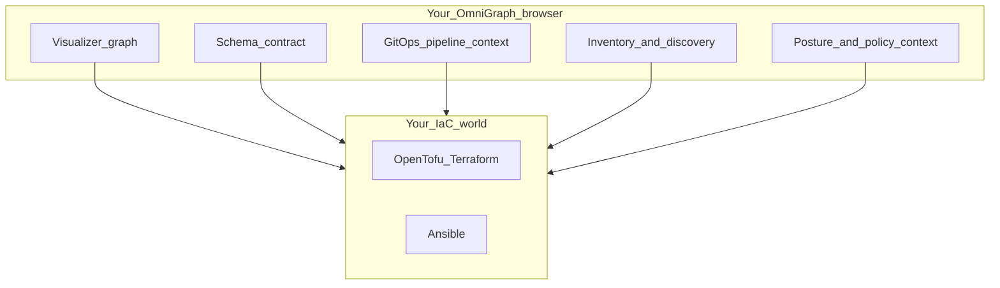

# OmniGraph

**Stop flying blind. See your infrastructure.**

If your platform relies on OpenTofu, Terraform, and Ansible, you juggle HCL, playbooks, and CI glue while the **picture** of what you actually deployed lives in people’s heads and log scrollback.

**OmniGraph** is a **web workspace for infrastructure as a graph**: one browser window where you **pan/zoom intent and topology**, wire in pipeline and inventory context, and keep posture beside the diagram—not a wall of terminals or “yet another pipeline CLI.” Your cloud tools stay yours; OmniGraph is where you **see** the story.



## What you get in the app

Open **`web/`** and you land in a **workspace** with a sidebar of tools around the same canvas mindset:

- **Visualizer** — Paste or load **`omnigraph/graph/v1`** and explore it as an **interactive graph** (nodes, edges, relationships—not log lines).
- **Schema Contract** — Work on your **`.omnigraph.schema`** project document **in the UI** with checks that meet you where you edit.
- **GitOps Pipeline** — See how **plan → apply → Ansible handoff** maps to paths and options, as **context for the map**, not a black-box script you memorize.
- **Inventory** — Bring in **state**, **plan JSON**, **Ansible inventory**, optional **folder scans**, or (when you add a backend) **workspace summary** from the same app.
- **Posture** — Keep **`omnigraph/security/v1`**-shaped posture data **next to the graph story** so compliance isn’t a separate PDF trail.
- **Web IDE** — Optional **WASM-backed HCL** feedback when you’re tweaking Terraform-flavored text.

Tab-by-tab tour: **[docs/using-the-web.md](docs/using-the-web.md)**.

---

## Run it (this is the whole quickstart)

**Node.js 20+**

```bash
cd web
npm ci
npm run dev
```

Open the URL Vite shows (typically `http://localhost:5173`). The app ships with **sample graph and schema** so you can **feel the product in under a minute**—then point it at your repo root and your own JSON from the sidebar.

Optional: same-origin **API + static build** for Inventory/server features is documented in **[docs/using-the-web.md](docs/using-the-web.md)** (no need to touch it to try the graph).

---

## Why we built it / deeper reading

- **[docs/product-philosophy.md](docs/product-philosophy.md)** — graph-first product intent (not a CI CLI pitch)  
- **[docs/README.md](docs/README.md)** — full documentation map  
- **[docs/overview.md](docs/overview.md)** — who / what / where  

Everything else—including anything **terminal-shaped** for teams that want it—is purposefully **not** on this page: **[docs/cli-and-ci.md](docs/cli-and-ci.md)**.

---

## License

[MIT](LICENSE) · [Contributing](CONTRIBUTING.md)
