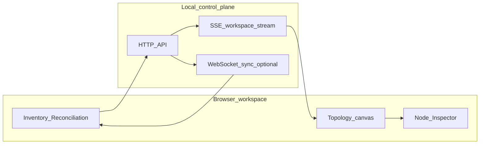

# OmniGraph

**Infrastructure as a visible, declarative graph—not scattered pipeline glue.**

**OmniGraph runs entirely on your machine:** a local Go control plane (when you use server-backed features) serves the React workspace to **your browser**. It is not a hosted SaaS unless you choose to deploy it that way—by default, data stays on your loopback and disk.

If your stack mixes OpenTofu/Terraform and Ansible, intent and handoffs often live in HCL, playbooks, CI YAML, and logs. Teams reconstruct topology and drift from fragments instead of **shared understanding** in one place.

**OmniGraph** is a **browser-based local workspace** for infrastructure as a graph: **schema-first intent** (`.omnigraph.schema` and versioned contracts), an **interactive topology**, and operational context—**reconciliation** (state, plan, inventory), **posture** (security shape)—without replacing OpenTofu, Terraform, or Ansible. Those tools remain your execution and provider layer; OmniGraph coordinates **visibility and handoff**. See **[docs/product-philosophy.md](docs/product-philosophy.md)** and **[docs/guides/ui-modes.md](docs/guides/ui-modes.md)**.

## What makes OmniGraph special

- **Graph-first shared understanding** — Relationships are nodes and edges you can explore, not only implicit script order.
- **Schema-first intent** — Contracts anchor what the workspace shows; the UI reflects the same shapes as automation outputs.
- **Browser workspace** — Topology, schema, pipeline context, inventory, and posture live together in one canvas.
- **Honest boundaries** — OpenTofu/Terraform/Ansible stay your engines; OmniGraph does not replace your provider layer.
- **Live backend truth** — When you use same-origin **serve**, **Server-Sent Events** and optional **WebSocket** sync keep the view aligned with normalized state (see **[docs/core-concepts/ux-architecture.md](docs/core-concepts/ux-architecture.md)**).
- **TOML-first human authoring** — **`.omnigraph.schema`** (Project intent) is **recommended in TOML** for day-to-day editing; the CLI and Schema Contract tab also accept **YAML** and **JSON** for compatibility. **Machine-shaped** artifacts—OpenTofu/Terraform **JSON state**, **plan JSON**, Ansible inventory, CI outputs—stay in the formats those tools emit; OmniGraph **ingests** them for reconciliation and graph emit **without** asking you to hand-maintain that noise for project intent.

## How OmniGraph supports declarative Ansible handoff

- **Intent is visible** — Graph and schema context sit beside inventory and plan-shaped data so handoffs are inspectable.
- **Diffable outcomes** — Plan and state artifacts map onto graph entities; you review **intent deltas** in the workspace, not only task logs.
- **Reconciliation context** — The workspace supports comparing declared graph intent against inventory and state views; Ansible remains the runtime you run.

## What you see in the web app

The sidebar groups **Topology** (interactive **`omnigraph/graph/v1`** and per-node **Inspector**), **Schema Contract**, **Pipeline** context, **Inventory** (including optional **File System Access** uploads when the API is enabled), **Posture**, and **Web IDE** (WASM-backed HCL hints). Full tab tour: **[docs/using-the-web.md](docs/using-the-web.md)**.

**New here?** Start with **[docs/getting-started.md](docs/getting-started.md)** (graph-first, no terminal steps).

---

## Quickstart (browser experience)

Open the workspace and land on **Topology**. You start with a **sample graph**—nodes and edges you can pan, select, and zoom. Click a node to open the **Inspector**: labels, kind, state, and optional debug lines attached to that vertex. Switch to **Reconciliation**-oriented tabs (**Inventory**) to see how state and inventory attach to the same story; use **Posture** when you are working security-shaped JSON alongside the graph. The UI stays **quiet until it needs to speak**: explore the sample graph first, then bring your own artifacts when you are ready.

To **run the dev server** or a **production build** locally, follow **[docs/development/local-dev.md](docs/development/local-dev.md)**. For **automation, CI, and the `omnigraph` binary** (validate, `graph emit`, `serve`, discovery), use **[docs/cli-and-ci.md](docs/cli-and-ci.md)**. Background **sync agent** (WebSocket, writable roots): **[agent/README.md](agent/README.md)**.

Same-origin **serve** with Inventory and SSE is described in **[docs/using-the-web.md](docs/using-the-web.md)**.

---

## Why we built it / deeper reading

- **[docs/product-philosophy.md](docs/product-philosophy.md)** — graph-first intent; automation supports the workspace
- **[docs/getting-started.md](docs/getting-started.md)** — first session in the UI only
- **[docs/README.md](docs/README.md)** — full documentation map
- **[docs/overview.md](docs/overview.md)** — who / what / where
- **[docs/core-concepts/ux-architecture.md](docs/core-concepts/ux-architecture.md)** — progressive disclosure, backend truth
- **[docs/guides/ui-modes.md](docs/guides/ui-modes.md)** — Topology, Reconciliation, Posture
- **[docs/guides/graph-dependencies-and-blast-radius.md](docs/guides/graph-dependencies-and-blast-radius.md)** — `dependencyRole` on graph edges; incident blast radius
- **[docs/core-concepts/data-handoff.md](docs/core-concepts/data-handoff.md)** — how provider state/plan/inventory reaches the web UI (SSE, emit)

---

## License

[MIT](LICENSE) · [Contributing](CONTRIBUTING.md)

---

## For contributors

Repository layout, emitter vs orchestration, Wasm, and E2E: **[docs/development/platform-architecture.md](docs/development/platform-architecture.md)** (includes the **architectural code map** and artifact ↔ schema tour). Clone, build, and test: **[CONTRIBUTING.md](CONTRIBUTING.md)**, **[docs/development/local-dev.md](docs/development/local-dev.md)**.
