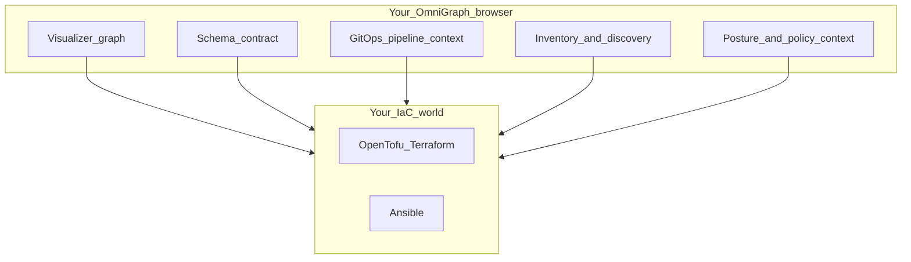

# OmniGraph

**Infrastructure as a visible, declarative graph - not scattered pipeline glue.**

If your stack mixes OpenTofu/Terraform and Ansible, the real deployment story is usually split across HCL, playbooks, CI YAML, and job logs. Teams spend time reconstructing intent, handoffs, and drift from terminal output instead of seeing one trustworthy view.

**OmniGraph** is a **web-first workspace for infrastructure as a graph**. It keeps your existing tools, but puts intent, topology, pipeline context, inventory, and security posture in one browser canvas so teams can reason about changes before and after they run.



## What makes OmniGraph special

- **Graph-first truth model** - Infra relationships are first-class nodes and edges, not implicit script order.
- **Web workspace, not CLI sprawl** - Visualizer, schema, pipeline context, inventory, and posture live together.
- **Declarative handoff to Ansible** - Desired state and graph context drive execution decisions.
- **Pipeline observability by default** - Plan/apply/handoff context is visible in the same place as topology.
- **Toolchain-compatible** - Keep OpenTofu/Terraform/Ansible; OmniGraph adds coordination and clarity.

## How OmniGraph makes Ansible declarative

OmniGraph shifts Ansible usage from "run these imperative steps in this order" toward "converge this graph-backed desired state":

- **State + intent are explicit**: graph/schema/inventory context define what should exist and how it relates.
- **Diffable desired outcomes**: plan and state artifacts are mapped back onto graph entities, so changes are reviewed as intent deltas, not only task logs.
- **Guided handoff**: CI plan/apply output and inventory context are attached to the same model Ansible acts on, reducing ad-hoc variable passing and brittle glue scripts.
- **Consistent reconciliation loop**: operators evaluate whether actual state matches declared graph intent, then run convergence actions with shared context.

Result: Ansible remains your execution engine, but the control plane becomes declarative and inspectable.

## How OmniGraph fixes common CI/CD frustrations

- **Pipeline opacity -> shared visibility**: job stages, infra changes, and handoffs are visible in one workspace.
- **Brittle IaC-to-Ansible glue -> model-based handoff**: fewer one-off scripts and fewer hidden assumptions between stages.
- **Environment drift surprises -> earlier detection**: state/plan/inventory context is compared against desired graph intent.
- **Slow incident triage -> faster root cause**: topology, change context, and posture are co-located instead of split across tools.
- **Context switching fatigue -> single workspace**: less hopping between CI UI, terminals, state files, and docs.

## What you get in the web app

Open **`web/`** and you land in a **workspace** with a sidebar of tools around the same canvas mindset:

- **Visualizer** — Paste or load **`omnigraph/graph/v1`** and explore it as an **interactive graph** (nodes, edges, relationships—not log lines).
- **Schema Contract** — Work on your **`.omnigraph.schema`** project document **in the UI** with checks that meet you where you edit.
- **GitOps Pipeline** — See how **plan → apply → Ansible handoff** maps to paths and options, as **context for the map**, not a black-box script you memorize.
- **Inventory** — Bring in **state**, **plan JSON**, **Ansible inventory**, optional **folder scans**, or (when you add a backend) **workspace summary** from the same app.
- **Posture** — Keep **`omnigraph/security/v1`**-shaped posture data **next to the graph story** so compliance isn’t a separate PDF trail.
- **Web IDE** — Optional **WASM-backed HCL** feedback when you’re tweaking Terraform-flavored text.

Tab-by-tab tour: **[docs/using-the-web.md](docs/using-the-web.md)**.

---

## Run it (this is the whole quickstart)

**Node.js 20+**

```bash
cd web
npm ci
npm run dev
```

Open the URL Vite shows (typically `http://localhost:5173`). The app ships with **sample graph and schema** so you can **feel the product in under a minute**—then point it at your repo root and your own JSON from the sidebar.

Optional: same-origin **API + static build** for Inventory/server features is documented in **[docs/using-the-web.md](docs/using-the-web.md)** (no need to touch it to try the graph).

---

## Why we built it / deeper reading

- **[docs/product-philosophy.md](docs/product-philosophy.md)** — graph-first product intent (not a CI CLI pitch)  
- **[docs/README.md](docs/README.md)** — full documentation map  
- **[docs/overview.md](docs/overview.md)** — who / what / where  

Everything else—including anything **terminal-shaped** for teams that want it—is purposefully **not** on this page: **[docs/cli-and-ci.md](docs/cli-and-ci.md)**.

---

## License

[MIT](LICENSE) · [Contributing](CONTRIBUTING.md)
