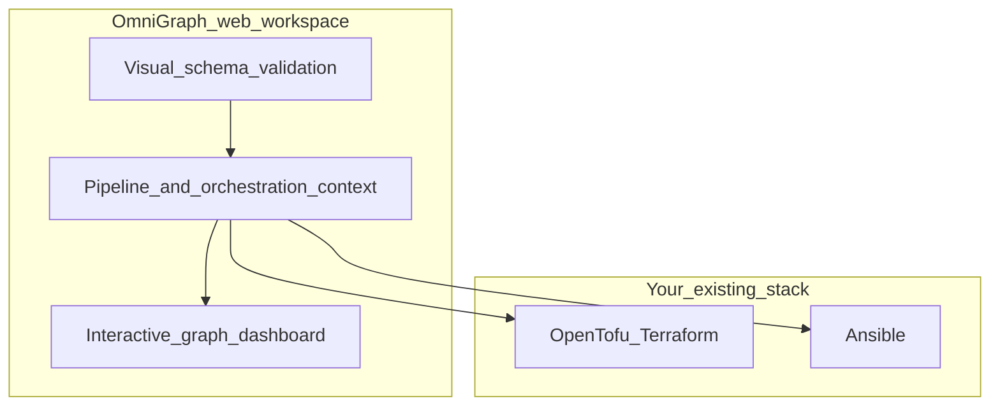

# OmniGraph

**Stop flying blind. See your infrastructure.**

If your platform relies on OpenTofu, Terraform, and Ansible, you are likely maintaining a tangled mess of disjointed sources of truth. HCL files, playbooks, and scattered CI scripts leave you guessing what your actual deployment posture looks like until something breaks.

**OmniGraph** is a **visual grapher and web workspace**: an interactive React UI built around `omnigraph/graph/v1` and related artifacts, so you can **see** intent, topology, pipeline context, and posture instead of living in log tail. A Go control plane and CLI sit underneath to validate schema, run orchestration when you need it, and emit the JSON the dashboard consumes—they are the engine, not “yet another generic pipeline CLI” story. OpenTofu, Terraform, and Ansible stay yours; OmniGraph connects and visualizes the handoff.



## Hook your stack into the matrix

OmniGraph is the **visual front door** to your operations. A single **`.omnigraph.schema`** project document anchors intent; the workspace turns that into something you can explore.

- **Interactive visualization:** Pan and inspect an **omnigraph/graph/v1** flow in the **Visualizer** tab—resources and relationships as a graph, not a wall of text.
- **Pipeline in context:** **GitOps Pipeline** composes the real `orchestrate` handoff; you see how plan, apply, and Ansible steps relate to your repo paths.
- **Policy and posture in the same surface:** **Schema Contract** validates documents; **Posture** holds `omnigraph/security/v1` payloads that enrich what you see; Rego policy gates apply in validation and automation paths.
- **Inventory and discovery:** **Inventory** ties plan JSON, state, Ansible inventory, optional **omnigraph serve** workspace summary, or a folder scan back into the workspace.
- **Optional HCL IDE:** **Web IDE** uses WASM-backed HCL diagnostics when enabled for local editing feedback.

For a walkthrough of each sidebar tab, see **[docs/using-the-web.md](docs/using-the-web.md)**.

---

## Fire up the dashboard

Requires **Node.js 20+**.

```bash
cd web
npm ci
npm run dev
```

Open the URL Vite prints (usually `http://localhost:5173`). The MVP loads with sample schema and graph JSON; paste your own `omnigraph/graph/v1` into **Visualizer**, or tune **Git repository root** and use **Inventory** to pull context from disk or a local **omnigraph serve** instance.

**Integrated API + UI:** build the static app (`npm run build` in `web/`), then run **`omnigraph serve --web-dist web/dist`** so the browser and **`/api/v1/*`** share an origin. See **`omnigraph serve --help`** for loopback defaults and optional authenticated APIs.

---

## Engine and automation (CLI)

The **`omnigraph`** binary validates documents, runs policy, emits graph JSON for CI, performs security scans, and drives **`orchestrate`** when you want headless or scripted pipelines. That work **feeds** the web workspace; it is documented as automation, not as the product headline.

```bash
go build -o bin/omnigraph ./cmd/omnigraph
./bin/omnigraph validate testdata/sample.omnigraph.schema
```

Full command recipes (CI, SSH scans, `serve` flags): **[docs/cli-and-ci.md](docs/cli-and-ci.md)**.

**Same document with policy, graph emit, scan, orchestrate** — quick samples:

```bash
./bin/omnigraph validate testdata/sample.omnigraph.schema --policy-dir testdata/policies
./bin/omnigraph validate testdata/sample.omnigraph.schema --policy-dir testdata/policies --enforce
./bin/omnigraph graph emit testdata/sample.omnigraph.schema \
  --telemetry-file testdata/sample.telemetry.json \
  --security-file testdata/sample.security.json > graph.json
./bin/omnigraph security scan --local --output ./local-scan.json
./bin/omnigraph orchestrate --workdir /path/to/tf/root --playbook ansible/site.yml
```

Use `--runner container` for isolated tool runs when needed. `--iac-engine=pulumi` is not implemented yet.

---

## Repository layout

| Path | Role |
|------|------|
| **`web/`** | React workspace: graph canvas, schema, pipeline, inventory, posture, Web IDE. |
| **`schemas/`** | JSON Schema contracts (`omnigraph/*/v1`). |
| **`wasm/`** | WASM modules used by the UI (e.g. HCL diagnostics). |
| **`cmd/omnigraph`** | CLI entrypoint. |
| **`internal/`** | Go control plane: validation, graph emit, orchestration, serve, policy, security. |
| **`testdata/`** | Fixtures for schema, policies, sample graph/telemetry/security JSON. |
| **`docs/`** | Canonical documentation, including [product philosophy](docs/product-philosophy.md). |
| **`wiki/`** | Short wiki navigation; see [wiki/SYNC.md](wiki/SYNC.md) to publish the GitHub Wiki tab. |

Example deployment write-ups under **`docs/reference-architectures/`** are illustrative only.

---

## Documentation and deep dives

- **[Documentation hub](docs/README.md)** — reading order and section map  
- **[Product philosophy](docs/product-philosophy.md)** — why visualization leads; what the CLI is for  
- **[Using the web workspace](docs/using-the-web.md)** — tabs, persistence, serve  
- **[Overview](docs/overview.md)** — who / what / where, diagrams  
- **[Security posture](docs/security/posture.md)** — policy, scans, hardening `serve`  

**License:** [MIT](LICENSE) · **[Contributing](CONTRIBUTING.md)**
