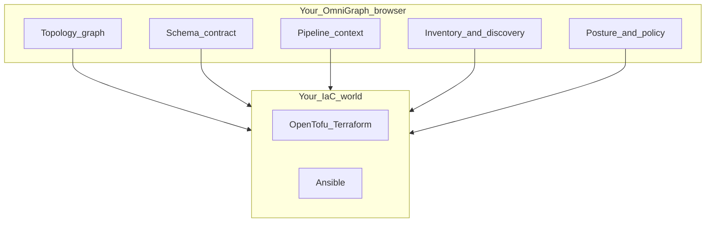
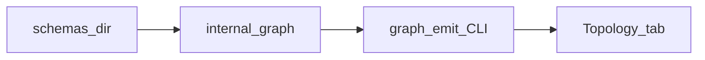

# OmniGraph

**Infrastructure as a visible, declarative graph - not scattered pipeline glue.**

If your stack mixes OpenTofu/Terraform and Ansible, the real deployment story is usually split across HCL, playbooks, CI YAML, and job logs. Teams spend time reconstructing intent, handoffs, and drift from terminal output instead of seeing one trustworthy view.

**OmniGraph** is a **web-first workspace for infrastructure as a graph**. It keeps your existing tools, but puts intent, topology, pipeline context, inventory, and security posture in one browser canvas so teams can reason about changes before and after they run.

The workspace is organized into three **operational contexts**—**Topology** (the declarative graph and node-scoped inspector), **Reconciliation** (state, plan, inventory, and pipeline handoff), and **Posture** (security and compliance shape)—so you are not staring at a single overloaded dashboard. See **[docs/guides/ui-modes.md](docs/guides/ui-modes.md)**. The **Go** control plane owns discovery, orchestration, and aggregation; the UI is built as a **reactive** surface, with authoritative live updates delivered over **Server-Sent Events**—**[docs/core-concepts/ux-architecture.md](docs/core-concepts/ux-architecture.md)**.



## What makes OmniGraph special

- **Graph-first truth model** — Infra relationships are first-class nodes and edges, not implicit script order.
- **Web workspace, not CLI sprawl** — Topology, schema, pipeline, inventory, and posture live together.
- **Declarative handoff to Ansible** — Desired state and graph context drive execution decisions.
- **Pipeline observability by default** — Plan/apply/handoff context is visible in the same place as topology.
- **Toolchain-compatible** — Keep OpenTofu/Terraform/Ansible; OmniGraph adds coordination and clarity.

## How OmniGraph makes Ansible declarative

OmniGraph shifts Ansible usage from "run these imperative steps in this order" toward "converge this graph-backed desired state":

- **State + intent are explicit**: graph/schema/inventory context define what should exist and how it relates.
- **Diffable desired outcomes**: plan and state artifacts are mapped back onto graph entities, so changes are reviewed as intent deltas, not only task logs.
- **Guided handoff**: CI plan/apply output and inventory context are attached to the same model Ansible acts on, reducing ad-hoc variable passing and brittle glue scripts.
- **Consistent reconciliation loop**: operators evaluate whether actual state matches declared graph intent, then run convergence actions with shared context.

Result: Ansible remains your execution engine, but the control plane becomes declarative and inspectable.

## How OmniGraph fixes common CI/CD frustrations

- **Pipeline opacity → shared visibility**: job stages, infra changes, and handoffs are visible in one workspace.
- **Brittle IaC-to-Ansible glue → model-based handoff**: fewer one-off scripts and fewer hidden assumptions between stages.
- **Environment drift surprises → earlier detection**: state/plan/inventory context is compared against desired graph intent.
- **Slow incident triage → faster root cause**: topology, change context, and posture are co-located instead of split across tools.
- **Context switching fatigue → single workspace**: less hopping between CI UI, terminals, state files, and docs.

## What you get in the web app

Open **`packages/web`** for a **workspace** with a sidebar grouped into operational contexts:

- **Topology** — Paste or load **`omnigraph/graph/v1`** and explore it as an **interactive graph** (nodes, edges, optional **`attributes.debugLog`** in the Inspector).
- **Schema Contract** — Edit **`.omnigraph.schema`** with validation in the UI.
- **Pipeline** — Map **plan → apply → Ansible handoff** to paths and `omnigraph orchestrate` options.
- **Inventory** — Paste **state**, **plan JSON**, **Ansible INI**, optional **folder scans**, or **`omnigraph serve`** workspace summary / **SSE** stream when same-origin.
- **Posture** — **`omnigraph/security/v1`**-shaped data next to the graph story.
- **Web IDE** — Optional **WASM-backed HCL** feedback (browser-only; see [docs/core-concepts/ux-architecture.md](docs/core-concepts/ux-architecture.md)).

Tab-by-tab tour: **[docs/using-the-web.md](docs/using-the-web.md)**.

## Architectural code map

| Path | Role in the product |
|------|---------------------|
| [`cmd/omnigraph`](cmd/omnigraph) | CLI entry → [`internal/cli`](internal/cli) (validate, `graph emit`, `serve`, `orchestrate`, …). |
| [`internal/`](internal/) | Go control plane: graph emission, HTTP **`serve`** (including SSE), orchestration, policy, [`internal/state`](internal/state) parsing, repo discovery. |
| [`packages/web`](packages/web) | React workspace: Topology, Inventory, SSE client [`useWorkspaceSummaryStream.ts`](packages/web/src/mvp/useWorkspaceSummaryStream.ts). |
| [`schemas/`](schemas/) | JSON Schema sources for versioned contracts (see **Codebase tour** below). |
| [`wasm/`](wasm/) | Browser Wasm (e.g. [`wasm/hcldiag`](wasm/hcldiag)) for editor-side HCL diagnostics—not Terraform state I/O. |
| [`e2e/`](e2e/) | Contributor end-to-end harness. |
| [`pkg/emitter`](pkg/emitter) | **IR → artifacts** (Emitter Engine): [`model.go`](pkg/emitter/model.go) carries `omnigraph/ir/v1`-shaped intent; backends such as [`emit_ansible.go`](pkg/emitter/emit_ansible.go) compile that into Ansible-oriented output. Manifest **reconciliation** (desired vs actual) lives in `internal/reconcile` / `omnigraph apply`, not here. |

**Live workspace stream (SSE):** implemented in Go as **`getWorkspaceStream`** on **`GET /api/v1/workspace/stream`** — see [`internal/serve/server.go`](internal/serve/server.go) (handler and route registration).



### Codebase tour: artifacts ↔ schema

| Product artifact | Where it is defined |
|------------------|---------------------|
| `omnigraph/graph/v1` (Topology JSON) | [`schemas/graph.v1.schema.json`](schemas/graph.v1.schema.json) |
| `.omnigraph.schema` (`Project`) | [`schemas/omnigraph.schema.json`](schemas/omnigraph.schema.json) |
| IR-shaped intent | [`schemas/ir.v1.schema.json`](schemas/ir.v1.schema.json) + [`pkg/emitter`](pkg/emitter) |

---

## Quickstart

### A — Browser (sample graph in under a minute)

**Node.js 20+**

```bash
cd packages/web
npm ci
npm run dev
```

Open the URL Vite prints (typically `http://localhost:5173`). The app ships with a **sample graph** in **Topology** and a default schema—then use **Inventory** to paste real **Terraform/OpenTofu JSON state**, **plan JSON**, or **Ansible INI** when you are ready.

Same-origin **`omnigraph serve`** + built UI (Inventory, SSE) is described in **[docs/using-the-web.md](docs/using-the-web.md)**.

### B — Go CLI + real state (copy-paste)

Minimal fixtures live under **[examples/quickstart/](examples/quickstart/)** (tiny `.tfstate.json` + `.omnigraph.schema` with YAML comments for a playbook-oriented repo layout).

```bash
go build -o bin/omnigraph ./cmd/omnigraph

./bin/omnigraph graph emit examples/quickstart/.omnigraph.schema \
  --tfstate examples/quickstart/minimal.tfstate.json > graph.json

./bin/omnigraph inventory from-state examples/quickstart/minimal.tfstate.json
```

Optional: add **`--plan-json`** to `graph emit` with output from **`terraform show -json tfplan`** (or OpenTofu equivalent). Full automation scenarios: **[docs/cli-and-ci.md](docs/cli-and-ci.md)**.

---

## Why we built it / deeper reading

- **[docs/product-philosophy.md](docs/product-philosophy.md)** — graph-first product intent (not a CI CLI pitch)
- **[docs/README.md](docs/README.md)** — full documentation map
- **[docs/overview.md](docs/overview.md)** — who / what / where
- **[docs/core-concepts/ux-architecture.md](docs/core-concepts/ux-architecture.md)** — progressive disclosure, backend truth, WASM boundary
- **[docs/guides/ui-modes.md](docs/guides/ui-modes.md)** — Topology, Reconciliation, Posture
- **[examples/quickstart/README.md](examples/quickstart/README.md)** — CLI quickstart detail

Terminal-oriented workflows: **[docs/cli-and-ci.md](docs/cli-and-ci.md)**.

---

## License

[MIT](LICENSE) · [Contributing](CONTRIBUTING.md)
