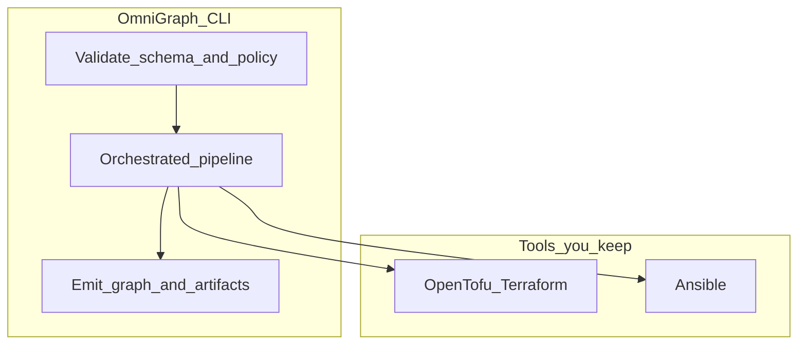

# OmniGraph

If you run OpenTofu or Terraform and still hand off to Ansible, you already maintain **several** sources of truth: HCL, playbooks, CI scripts, and ad-hoc checks. OmniGraph adds a **single schema-backed project document** (`.omnigraph.schema`) as the front door: validate it, attach **Rego policy** if you want gates, then drive **plan → check → approve → apply → Ansible** from one CLI—or stop at validation and **graph JSON** if that is all you need. The binary does not hide your stack; it **coordinates** it and produces **versioned artifacts** (`omnigraph/graph/v1`, optional telemetry and security posture) for automation or the React UI in `web/`.



**What the CLI is for (in practice):** `validate` and `policy` for intent and governance; `orchestrate` (alias `pipeline`) for the full handoff; `graph emit` for UI/CI snapshots; `security scan` for read-only posture JSON you can merge into graphs; `serve` for a local HTTP API and optional static UI. Run `omnigraph --help` after building.

---

## Build

**Go 1.23+** (CI uses a newer toolchain; see `go.mod` / `.github/workflows/ci.yml`).

```bash
go build -o bin/omnigraph ./cmd/omnigraph
./bin/omnigraph --help
```

```powershell
go build -o bin\omnigraph.exe .\cmd\omnigraph
.\bin\omnigraph.exe --help
```

Also available: `Makefile`, `build-windows.cmd`.

## Run it on the sample files

Under **`testdata/`** there are real inputs you can use without writing your own repo yet.

Schema check only:

```bash
./bin/omnigraph validate testdata/sample.omnigraph.schema
```

Same document **plus** embedded Rego policy sets (fails with `--enforce` if a `deny` rule hits):

```bash
./bin/omnigraph validate testdata/sample.omnigraph.schema --policy-dir testdata/policies
./bin/omnigraph validate testdata/sample.omnigraph.schema --policy-dir testdata/policies --enforce
```

Emit **`omnigraph/graph/v1`** JSON with merged telemetry and security fixtures:

```bash
./bin/omnigraph graph emit testdata/sample.omnigraph.schema \
  --telemetry-file testdata/sample.telemetry.json \
  --security-file testdata/sample.security.json > graph.json
```

**Passive posture scan** (authorized targets only—see `omnigraph security --help`):

```bash
./bin/omnigraph security scan --local --output ./local-scan.json
```

**Full orchestration** needs your own OpenTofu/Terraform root, playbook path, and credentials via **environment variables** only (no secrets in committed schema). Example shape:

```bash
./bin/omnigraph orchestrate --workdir /path/to/tf/root --playbook ansible/site.yml
```

Use `--runner container` when you want Docker/Podman-isolated tool runs. `--iac-engine=pulumi` is not implemented yet.

## Web UI

**Node.js 20+.** From `web/`: `npm ci`, then `npm run dev`. Production build: `npm run build`; serve with `omnigraph serve --web-dist web/dist` if you want the API and UI on loopback (treat non-local binds and experimental API flags carefully—see `omnigraph serve --help`).

## Repository layout (quick)

| Path | Role |
|------|------|
| `cmd/omnigraph` | CLI entrypoint |
| `internal/` | Control plane implementation |
| `schemas/` | JSON Schema contracts (`omnigraph/*/v1`) |
| `testdata/` | Fixtures for the commands above |
| `docs/` | Long-form docs, Mermaid diagrams, ADRs, reference architectures |
| `web/` | React frontend |
| `wasm/` | WASM helpers used by the UI/runtime |
| `wiki/` | Short navigation + [how to publish GitHub Wiki](wiki/SYNC.md) |

Example deployment write-ups under `docs/reference-architectures/` are **illustrative**, not mandatory patterns.

## Contributing and license

**[CONTRIBUTING.md](CONTRIBUTING.md)** · **[LICENSE](LICENSE)** (MIT)

---

*More depth (architecture, execution matrix, IR model, security posture): everything expands from **[docs/README.md](docs/README.md)**—but you should not need it to build, validate, or emit a graph from this page.*
