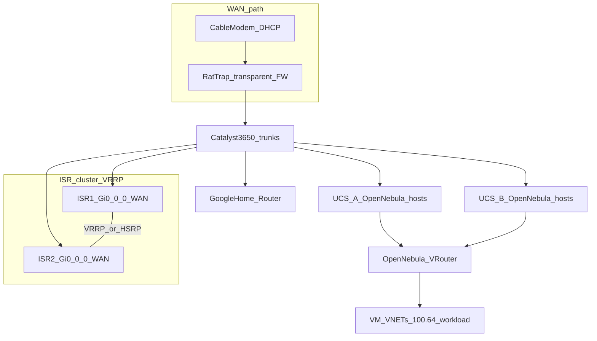
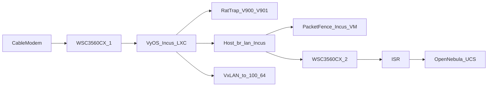

# OpenNebula / ISR — VLAN & addressing matrix

**Site profile:** Edge compute / home lab handoff on **192.168.86.0/24**. WAN is a **routed** interface using **DHCP** from the ISP. **Single NAT** = **PAT/NAT overload only on the WAN** (no SNAT on the OpenNebula Virtual Router for traffic destined to the Internet).

**Mini PC / VyOS edge (optional):** When a dedicated **mini PC** runs **VyOS + PacketFence + RatTrap**, **PAT to the cable modem** is documented on **VyOS WAN** (see [docs/opennebula-gitea-edge/EDGE-MINI-PC-VYOS-PACKETFENCE.md](../../docs/opennebula-gitea-edge/EDGE-MINI-PC-VYOS-PACKETFENCE.md)). The **ISR** remains downstream for **OpenNebula UCS** and **`100.64` platform carve**; **OSPF** uses a **dedicated transit VLAN** — **not** RatTrap **900/901**.

**VLAN scheme:** `2000 + third octet` of each **100.64._x_.0/24** segment (e.g. `100.64.10.0/24` → VLAN **2010**). **Edge compute LAN** uses **VLAN 86** (mnemonic for `.86/24`). Change VLAN IDs if they collide with existing home/Cisco config.

**Physical edge / transit VLANs** (do **not** apply the `2000 + octet` rule — keep them in a separate table from service VNETs):

| VLAN | Role | Where | Notes |
|------|------|-------|-------|
| **99** | WAN / ISP | **WS-C3560CX-1** access — modem + mini PC **eth0** | VyOS WAN DHCP (mini PC); if ISR still has a cable path, use a **different** access VLAN per site policy — **only one** device should PAT to the modem for a given migration |
| **900** | RatTrap **inside** (clean) | CX-1 access toward appliance | **VyOS vif 900**; optional **no** L3 SVI on the switch if VyOS owns both `/30` ends |
| **901** | RatTrap **outside** (dirty) | CX-1 access return path | Pairs with **900** for hairpin |
| **298** (example) | **VyOS ↔ ISR OSPF transit** | CX-1 ↔ CX-2 trunk + ISR L3 | **Do not** use **900/901** for OSPF; pick an ID that does not collide with NAC or home VLANs |
| **86** | Edge compute LAN | Trunks to UCS / hypervisors | Same as **`devsecops-edge`** matrix row |

**Mini PC mapping:** **eth0** = VLAN **99** (WAN); **eth1** = **802.1Q trunk** (allowed: internal VLANs + **900** + **901** + PacketFence/NAC VLANs + **298** + **86** as designed).

**North–south contract:** `100.64.x.0/24` workloads keep the **`2000 + third octet`** VLAN rule for **OpenNebula VNETs**; **physical edge** VLANs above are **not** derived from `2000 + third octet`.

## Matrix (20 VNETs)

| VLAN | OpenNebula VNET `NAME` | Template file (suggested) | IPv4 segment | Notes |
|------|------------------------|---------------------------|--------------|--------|
| 2001 | `devsecops-gitea` | `gitea-vnet.one` | 100.64.1.0/24 | Gitea, docs-sync |
| 2002 | `devsecops-n8n` | `n8n-vnet.one` | 100.64.2.0/24 | n8n, n8n-mcp |
| 2003 | `devsecops-zammad` | `zammad-vnet.one` | 100.64.3.0/24 | Zammad stack |
| 2004 | `devsecops-bitwarden` | `bitwarden-vnet.one` | 100.64.4.0/24 | Vaultwarden |
| 2005 | `devsecops-gateway` | `gateway-vnet.one` | 100.64.5.0/24 | Traefik / single pane |
| 2006 | `devsecops-portainer` | `portainer-vnet.one` | 100.64.6.0/24 | Portainer |
| 2007 | `devsecops-llm` | `llm-vnet.one` | 100.64.7.0/24 | BitNet / LLM |
| 2008 | `devsecops-chatops` | `chatops-vnet.one` | 100.64.8.0/24 | Zulip backends |
| 2010 | `devsecops-messaging` | `messaging-vnet.one` | 100.64.10.0/24 | Postgres, Kafka, Solace, NiFi, … |
| 2020 | `devsecops-iam` | `iam-vnet.one` | 100.64.20.0/24 | Vault, Keycloak, Teleport |
| 2021 | `devsecops-freeipa` | `freeipa-vnet.one` | 100.64.21.0/24 | FreeIPA |
| 2030 | `devsecops-agent-mesh` | `agent-mesh-vnet.one` | 100.64.30.0/24 | SAM + agents |
| 2040 | `devsecops-discovery` | `discovery-vnet.one` | 100.64.40.0/24 | NetBox, Dependency-Track |
| 2050 | `devsecops-sdn-lab` | `sdn-lab-vnet.one` | 100.64.50.0/24 | OVS, VyOS leg, n8n sFlow path |
| 2051 | `devsecops-telemetry` | `telemetry-vnet.one` | 100.64.51.0/24 | Prometheus, Grafana, sFlow-RT |
| 2052 | `devsecops-docs` | `docs-vnet.one` | 100.64.52.0/24 | Docs Nginx |
| 2053 | `devsecops-sonarqube` | `sonarqube-vnet.one` | 100.64.53.0/24 | SonarQube UI |
| 2054 | `devsecops-siem` | `siem-vnet.one` | 100.64.54.0/24 | Wazuh stack |
| 2250 | `devsecops-ceph` | `ceph-vnet.one` | 100.64.250.0/24 | Ceph MON/OSD **public** (and optional **cluster** split); no Internet |
| **86** | `devsecops-edge` | `edge-vnet.one` | **192.168.86.0/24** | Edge compute / home LAN; ISR SVI; trunks to UCS/hypervisors |

**Workload third octets in use (do not overlap):** `1–8, 10, 20–21, 30, 40, 50–54` for the **original** 18 service VM VNETs; **`250`** is reserved for **`devsecops-ceph`** (storage back-end). **Platform / WAN-adjacent infra** below uses **high octets `240–254`** inside the same **100.64.0.0/10** space (RFC 6598 — document for ops); **`250`** is also listed in the **Platform carve** table.

## Rudimentary topology (physical → logical)

### A) Legacy / collapsed core (ISR on WAN)



- **Gi0/0/0** on each ISR faces the **WAN path** (via 3650 or direct to rat-trap/modem per your patch panel). **Gi0/0/1** (and peers) face **inside** VLANs on the **3650** trunks (UCS, Google, MGMT, **100.64.240+** SVIs).
- **VRRP/HSRP** VIPs live in the **platform carve** (e.g. **100.64.240.0/24**). **Single PAT** stays on **WAN** toward the modem.
- **Google Home** sits **behind** the ISR path (L3 on the 3650); **100.64.244.0/24** is the suggested **LAN** where Google keeps **DHCP** for Wi‑Fi clients (ISR routes/NATs that prefix).

### B) Mini PC edge (VyOS + RatTrap + downstream ISR)

Cable modem and mini PC **WAN** share **VLAN 99** on **WS-C3560CX-1**; **VyOS** (Incus LXC) performs **PAT** to ISP; **RatTrap** uses **900/901**; **ISR** peers over **OSPF** on a **dedicated transit** (e.g. **VLAN 298**). Full narrative: [EDGE-MINI-PC-VYOS-PACKETFENCE.md](../../docs/opennebula-gitea-edge/EDGE-MINI-PC-VYOS-PACKETFENCE.md).



- **CX-1 ↔ CX-2 trunk:** extend only VLANs required for compute, storage, and **VyOS↔ISR transit** (plus any shared **86** / workload trunks).
- **Default gateway / PAT:** With this profile, **VyOS** is the **Internet gateway** for VLANs you terminate on the mini PC trunk; **ISR** remains default gateway for **UCS / platform carve** segments **south** of the ISR unless you migrate SVIs — document **one** PAT path (see edge doc).

## Platform carve (100.64.240–254)

Fixed **/24** blocks (adjust if you need wider masks per UCS). None of these collide with service workload octets **1–8, 10, 20–21, 30, 40, 50–54**. **Octet 250** is allocated to **Ceph** (`devsecops-ceph`), not spare.

| Third octet | CIDR | Purpose |
|-------------|------|---------|
| **240** | **100.64.240.0/24** | **ISR↔3650 “inside” core** — SVIs, **VRRP/HSRP VIP**, default GW for infra VLANs |
| **241** | **100.64.241.0/24** | **Catalyst 3650** loopback / mgmt / switch SVIs |
| **242** | **100.64.242.0/24** | **ISR `Mgmt0`** (and similar) — out-of-band-style reachability on L3 |
| **243** | **100.64.243.0/24** | **ISR ↔ Google WAN** — carve a **/30** inside for the hop; rest spare |
| **244** | **100.64.244.0/24** | **Google Home LAN** — DHCP to mesh/clients; **ip nat inside** on ISR for this prefix toward WAN |
| **245** | **100.64.245.0/24** | **UCS-A OpenNebula host underlay** (resize to /27 /28 if needed); **IMC** e.g. `.10`, ISR **`ucse1/0/0`** (or your slot) **`.1`** per Ansible `cisco_isr_ucse_modules` |
| **246** | **100.64.246.0/24** | **UCS-B OpenNebula host underlay**; **IMC** e.g. `.10`, **`ucse2/0/0`** **`.1`** (ISR4k **SM** `subslot 2/0`) |
| **247** | **100.64.247.0/24** | **UCS-C …** (add rows per chassis) |
| **248–249, 251–254** | **100.64.248.0/24** … *(skip .250)* … **100.64.254.0/24** | **Spare /24s** — growth, iLO, optional edge-LAN migration |
| **250** | **100.64.250.0/24** | **Ceph** — OpenNebula VNET **`devsecops-ceph`**, VLAN **2250** (`2000 + 250`); see [docs/opennebula-gitea-edge/03-storage-ceph-datastores.md](../../docs/opennebula-gitea-edge/03-storage-ceph-datastores.md) |

**UCS-E on ISR4351 (inventory `SM subslot 1/0` / `2/0`):** IOS-XE uses **`ucse subslot 1/0`** (IMC / “CIMC” IP) and **`interface ucse1/0/0`** for the router’s internal L3 (or trunk) toward the blade. See **`ansible/roles/cisco_isr_platform/`** `ucse.yml` + defaults. VLAN mnemonic for a matching 802.1Q tag on the **Gi** trunk (optional) is **2245** / **2246** (= 2000 + third octet); only use the same /24 on **one** L3 place (ucse **or** a dedicated SVI), unless you design VRRP/HSRP intentionally.

**Edge LAN note:** **192.168.86.0/24** (VLAN 86) can remain for laptops/edge compute **or** you can **migrate** that role into **100.64** (e.g. spare in **248–254**) so **all** RFC6598 numbering is contiguous; if you migrate, update `devsecops-edge` AR and ISR SVI accordingly.

## Roadmap: leaf–spine switching (not today)

**Today:** Collapsed core / aggregation with **Catalyst 3650** (diagram) and/or **C3560-CX** access switches — Ansible playbooks live under [`ansible/playbooks/network-*.yml`](../../ansible/playbooks/network-site.yml).

**Future:** Replace/augment with **leaf–spine** (e.g. Nexus / 9K / whitebox) when hardware allows. Expect:

- **Underlay:** eBGP or IS-IS for spine; **one VLAN/VNI per segment** or **VXLAN EVPN** instead of long 802.1Q trunks everywhere.
- **IP addressing:** Keep the same **100.64 workload octets** and **240–254 platform carve** at the **logical** layer; remap **which device terminates SVIs** (border leaf vs ISR).
- **ISR role:** Often **north** of the fabric (WAN + firewall policy) or **on a DMZ leaf pair**; update Ansible **roles** when you cut over (new `cisco_nxos` or vendor collection alongside `cisco.ios`).

## Virtual Router (recommended addressing)

- On each **100.64._x_.0/24** VNET, reserve **100.64._x_.1** for the VR (default gateway for VMs on that segment).
- On **devsecops-edge**, reserve **192.168.86.2** for the VR (example); **192.168.86.1** = ISR SVI on VLAN 86.
- VR **default route:** `0.0.0.0/0` → **192.168.86.1** (ISR).
- ISR **static routes:** summarize or enumerate **100.64.0.0/10** (or tighter prefixes per segment) **via** the VR’s **next hop** on the segment where the VR is homed (often **192.168.86.2** on VLAN 86). If VR runs on **one UCS** only, other UCS subnets need **ISR routes** to **100.64.0.0/10** via that next-hop (or run **VR redundant / per-site**).

**Do not** enable NAT on the VR for Internet-bound traffic if the **edge router** (ISR **or** VyOS) already performs **single NAT** on the WAN — use **routing only** between 100.64 segments and 192.168.86.0/24.

## Gateway and NAT (VyOS mini PC vs ISR-only)

| Profile | **PAT / default route to Internet** | **Google Home `100.64.244.0/24`** |
|---------|--------------------------------------|-----------------------------------|
| **ISR-only** (diagram A) | **ISR WAN** | **ISR** SVI + NAT toward WAN (platform carve) |
| **Mini PC VyOS** (diagram B) | **VyOS** on **VLAN 99** (mini PC **eth0**) — **single** PAT to modem | **Default (this repo):** keep **ISR** SVI + NAT context; use **VyOS PBR + RatTrap** for **other** IoT/lab VLANs. **Future:** migrate SVI to **VyOS vif** + **redistribute static** into **OSPF** — requires cutover |

**Rules:** **Do not** stack **two** PAT hops to the same ISP path for the same flows without explicit policy. **OSPF** between **VyOS** and **ISR** uses the **dedicated transit VLAN** (e.g. **298**), **not** RatTrap **900/901**.

Authoritative narrative: [EDGE-MINI-PC-VYOS-PACKETFENCE.md](../../docs/opennebula-gitea-edge/EDGE-MINI-PC-VYOS-PACKETFENCE.md) · ISR overlays: [docs/CISCO_ISR_EDGE.md](../../docs/CISCO_ISR_EDGE.md).

## ISR / WAN (single NAT)

| Role | Typical config |
|------|----------------|
| **WAN** | Routed L3 interface; `ip address dhcp`; **ip nat outside**; default route via DHCP. |
| **LAN (edge)** | SVI `Vlan86` → **192.168.86.1/24**; **ip nat inside**; reachability to edge clients (and to VR if homed here). |
| **Per-UCS networks** | ISR has a **separate routed segment per UCS** (see below); **OpenNebula front-end nodes** live there — **not** all UCS on one shared ISR LAN if the ISR model forbids it. |
| **NAT** | Single **PAT** policy: inside **100.64.0.0/10** + **192.168.86.0/24** (or split if you only want workloads NAT’d) → overload **WAN**. Adjust ACL to match policy (e.g. exclude hairpin to other internal nets). **VyOS edge profile:** PAT on **VyOS WAN** instead; ISR **without** modem DHCP may only **route** toward VyOS via **OSPF/static**. |

## OpenNebula `*.one` snippet (per VNET)

Set on each template (adjust `PHYDEV` to your trunk NIC / bond):

```text
VN_MAD = "bridge"
BRIDGE = "onebr-devsecops-<short>"
PHYDEV = "eth0"
VLAN_ID = "<from matrix>"
```

For **edge** (`edge-vnet.one`):

```text
NAME   = "devsecops-edge"
DESCRIPTION = "Edge compute / home LAN 192.168.86.0/24 — ISR SVI VLAN 86"
VN_MAD = "bridge"
BRIDGE = "onebr-devsecops-edge"
PHYDEV = "eth0"
VLAN_ID = "86"
AR = [ TYPE = "IP4", IP = "192.168.86.3", SIZE = 100, LEASES = "YES" ]
```

*(AR start `192.168.86.3` leaves .1 ISR, .2 VR; extend pool as needed.)*

## ISR constraint: one network per UCS (OpenNebula hosts) — **variable prefix length**

**Rule:** The ISR deployment is **simple / “dumb” at L3**: **each UCS domain** (chassis + FI pair + the **OpenNebula KVM nodes** on that fabric) must sit on its **own IPv4 subnet** as seen by the ISR — **no** combining two UCS installations into **one** ISR-connected LAN if that breaks the router’s addressing model.

- **OpenNebula front-end (hypervisor) IPs**, and typically **in-band management** for those hosts, are numbered out of **that UCS’s dedicated subnet**.
- **Prefix length is variable** (`/29` … `/24` or wider if policy allows): size each subnet for **# of hypervisor nodes**, **FI/mgmt**, **reserved growth**, and any **L3 hop** inside the UCS (e.g. small `/30` or `/31` P2P **before** the UCS’s “host” block is also fine — see below).
- The **19 × 100.64** workload VNETs remain **VM networks** (OpenNebula `onevnet`); they are **not** the ISR-facing UCS subnet unless you intentionally bridge (usually you **route** VM traffic via **VR** instead).

### Why variable length

| Need | Typical size |
|------|----------------|
| 1–2 hypervisors + default gw | `/29`–`/28` |
| Half rack / several blades as ONe nodes | `/27`–`/26` |
| Large cluster + mgmt + iLO/OOB on same L3 (if you collapse) | `/24` |
| ISR ↔ FI or WAN edge **only** | `/30` or `/31` (P2P) |

Pick **one contiguous supernet** in IPAM (e.g. `10.48.0.0/16`) and **allocate non-overlapping children** per UCS; lengths **do not** need to match between sites. **Alternatively**, for a single-site **100.64-only** design, use the **UCS host /24s** in **Platform carve (100.64.240–254)** below (**245–247** by default; subdivide or renumber as you add chassis).

### Per-UCS assignment table (template)

| UCS / site ID | OpenNebula cluster name | CIDR (variable) | ISR side | Default GW for hosts | Trunk VLANs (local) |
|-----------------|-------------------------|-----------------|----------|------------------------|----------------------|
| UCS-A | `one-cluster-dc1` | e.g. `10.48.10.0/27` | ISR `Gi0/x.y` or SVI | `10.48.10.1` | 86, 2001–2054 + infra |
| UCS-B | `one-cluster-dc2` | e.g. `10.48.11.0/28` | ISR `Gi0/x.z` | `10.48.11.1` | same IDs, different L3 |
| … | … | … | … | … | … |

**ISR config pattern:** `ip route 100.64.0.0/10 <next-hop>` per UCS if the **VR** lives behind a specific cluster, or **one route per site** if each site runs its own VR — align with where **192.168.86.x** and **VR** are actually homed.

### Optional: P2P links **and** per-UCS host subnets

You can still carve **/30** (or **/31**) **only** for **ISR↔FI** or **ISR↔upstream**, then use a **separate variable-length subnet** behind the FI for **OpenNebula hosts** (the ISR learns it via **static** or **connected** on the FI side if the ISR peers with FI, or via **static route** to the FI’s loopback/next-hop). The earlier “/24 sliced into /30s” idea applies to **transport**; **host numbering** uses **another row** in the table above with **whatever /n fits**.

### L2 consistency across UCS

The **same VLAN IDs** (e.g. **2010** = messaging) can be reused **inside each UCS** on local trunks to hypervisors; broadcast domains **do not** span UCS **unless** you add **L2 extension** (not assumed here). **East–west VM traffic** between UCS-A and UCS-B goes **L3** (VR, ISR, or overlay) — design VR placement accordingly.

### Relationship to other sections

- **192.168.86.0/24** — edge compute / home; may attach **one** UCS or **none** (VR-only clients).
- **100.64.0.0/10** — workload VNETs; routed behind VR.
- **Per-UCS subnets** — **underlay** for **OpenNebula nodes**; **variable length**; **one ISR-visible network per UCS**.

## References

- **Mini PC VyOS + PacketFence + RatTrap** (edge architecture): [docs/opennebula-gitea-edge/EDGE-MINI-PC-VYOS-PACKETFENCE.md](../../docs/opennebula-gitea-edge/EDGE-MINI-PC-VYOS-PACKETFENCE.md)
- **Reduce Docker** (native / Podman): [docs/opennebula-gitea-edge/REDUCE-DOCKER.md](../../docs/opennebula-gitea-edge/REDUCE-DOCKER.md)
- **AlmaLinux 10 LXC** (per stack, OpenNebula): [docs/opennebula-gitea-edge/LXC-ALMA10-OPENNEBULA.md](../../docs/opennebula-gitea-edge/LXC-ALMA10-OPENNEBULA.md)
- **Docker Compose stacks** (IAM, messaging, tooling, gateway): [docs/opennebula-gitea-edge/CONTAINER-LIFT-TO-OPENNEBULA.md](../../docs/opennebula-gitea-edge/CONTAINER-LIFT-TO-OPENNEBULA.md)
- **Entire monorepo** re-point when Gitea moves: [docs/opennebula-gitea-edge/WHOLE-REPO-MIGRATION-SCOPE.md](../../docs/opennebula-gitea-edge/WHOLE-REPO-MIGRATION-SCOPE.md)
- OpenNebula **VNET** template directory: [onevnet/README.md](onevnet/README.md) (`*.one` for edge, gitea, gateway, ceph)
- Refined operator checklist: [docs/opennebula-gitea-edge/REFINED-EXECUTION.md](../../docs/opennebula-gitea-edge/REFINED-EXECUTION.md)
- Canonical segment list: [docs/NETWORK_DESIGN.md](../../docs/NETWORK_DESIGN.md)
- WSL2 / LXC path (same compose, pre-OpenNebula): [docs/WSL2_LXC_MIGRATION.md](../../docs/WSL2_LXC_MIGRATION.md)
- Migration plan (Phases 2–3): see repo planning docs / `.cursor/plans`
