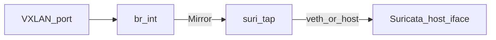

# SDN (OVS / VyOS / VXLAN) + Telemetry + ChatOps

This document supports the **docker-compose.network.yml**, **docker-compose.telemetry.yml**, **Traefik** routes (`/grafana`, `/sflow-rt`), **n8n** on `sdn_lab_net`, and **secrets-bootstrap** options for zero-disk secrets.

## Host prerequisites (AlmaLinux 10 / RHEL-family)

OVS, VyOS-style routing, and optional VXLAN plugins are intended for a **Linux Docker host**, not Docker Desktop on Windows.

```bash
sudo systemctl enable --now docker

# Open vSwitch kernel module + userspace (package names may vary)
sudo modprobe openvswitch || true
sudo dnf install -y openvswitch iproute

# Optional: community VXLAN network plugin for Docker (verify image tag before production)
# sudo docker plugin install trilliumit/docker-vxlan-plugin:latest --grant-all-permissions
# sudo docker network create -d vxlan ... sdn_vxlan
```

**Alternative:** Keep Docker on normal `bridge` networks and terminate VXLAN inside **host OVS** (`ovs-vsctl add-port br0 vxlan0 -- set interface vxlan0 type=vxlan ...`). Phase 1 compose uses **external `sdn_lab_net`** (bridge) for single-host labs.

## Docker networks

Run `scripts/create-networks.ps1` (or create manually):

| Network         | Subnet (default)   | Use |
|----------------|--------------------|-----|
| `sdn_lab_net`  | `100.64.50.0/24`   | VyOS lab leg, sFlow exporters → sFlow-RT, **n8n** attachment |
| `telemetry_net`| `100.64.51.0/24`   | Prometheus ↔ Grafana ↔ sFlow-RT; **Traefik** joins this for gateway paths |

Internal **`ovs_internal`** is defined only in `docker-compose.network.yml` (OVS ↔ VyOS data path).

**n8n on the SDN:** `docker-compose.tooling.yml` attaches **n8n** to external **`sdn_lab_net`** (in addition to `n8n_net` and `msg_backbone_net`) so workflows can call SDN services by Docker DNS (e.g. `vyos`, `sflow-rt`).

## Bring-up

```powershell
cd docker-compose
# Ensure process env has secrets (e.g. .\scripts\secrets-bootstrap.ps1 -StartStack:$false after Vault export)
docker compose -f docker-compose.network.yml up -d
docker compose -f docker-compose.telemetry.yml up -d
```

Optional host plumbing after OVS/VyOS are up: `sudo ./scripts/sdn-plumb.sh [br-int]`.

## Traefik (Single Pane of Glass)

Traefik uses the **file provider**. `telemetry_net` is attached in `single-pane-of-glass/docker-compose.yml` so routes resolve:

- **Grafana:** `http://<gateway>/grafana/` — set `GF_SERVER_ROOT_URL` / `GRAFANA_ROOT_URL` to match (e.g. `http://localhost/grafana`).
- **sFlow-RT UI:** `http://<gateway>/sflow-rt/`

## Grafana + Keycloak OIDC

1. Create a Keycloak client (e.g. `grafana`, confidential).
2. **Valid redirect URI:** `http://<gateway>/grafana/login/generic_oauth` (adjust scheme/host for production).
3. Set process environment (or Vault → `start-from-vault.ps1`):

   - `GRAFANA_OIDC_ENABLED=true`
   - `GRAFANA_OIDC_CLIENT_ID=grafana`
   - `GRAFANA_OIDC_CLIENT_SECRET=<from Vault>`
   - `KEYCLOAK_PUBLIC_URL`, `KEYCLOAK_REALM` aligned with IAM stack

Compose defaults: `GRAFANA_OIDC_ENABLED=false` until you set the above.

## VyOS: NAT / routing (illustrative)

Inside VyOS configuration mode (see VyOS documentation for your image/version):

```text
set interfaces ethernet eth0 address dhcp
# or static on lab uplink:
# set interfaces ethernet eth0 address 100.64.50.2/24

set nat source rule 10 outbound-interface 'eth0'
set nat source rule 10 source address '10.200.0.0/16'
set nat source rule 10 translation address masquerade

set protocols static route 0.0.0.0/0 next-hop <underlay-gateway>
```

Tune interfaces (`eth0` / `eth1`) to match how you plumbed VyOS to OVS vs `sdn_lab_net`.

## sFlow: VyOS → sFlow-RT

Point the VyOS **sflow** agent at the collector DNS name on `sdn_lab_net` (Docker service name):

- Target: **`sflow-rt:6343`** (UDP **6343**) — from VyOS, use the container’s IP on `sdn_lab_net` if hostname resolution is not available from the VyOS network namespace.

Illustrative **VyOS 1.4** configuration (see [system sflow](https://docs.vyos.io/en/1.4/configuration/system/sflow.html); interface names must match your plumbing):

```text
set system sflow agent-address '<vyos-ip-on-sdn-or-loopback>'
set system sflow interface 'eth0'
set system sflow interface 'eth1'
set system sflow sampling-rate 256
set system sflow polling 30
set system sflow server '<sflow-rt-ip-on-sdn-lab-net>' port '6343'
```

The collector endpoint remains **UDP 6343** on the sFlow-RT service (`sflow-rt` on `sdn_lab_net` when VyOS shares that Docker network).

## sFlow: Open vSwitch → sFlow-RT

From a shell with `ovs-vsctl` (host or **inside** `devsecops-openvswitch`):

```bash
COLLECTOR_IP=<sflow-rt IP on sdn_lab_net>   # e.g. resolve sflow-rt from telemetry + sdn attachment
AGENT_IP=<OVS bridge IP or router id>

docker exec devsecops-openvswitch ovs-vsctl -- \
  --id=@sflow create sflow agent="$AGENT_IP" target=\"$COLLECTOR_IP:6343\" header=true sampling=256 polling=20 \
  -- set bridge br-int sflow=@sflow
```

Replace `br-int` with your integration bridge name. Create the bridge first (`scripts/sdn-plumb.sh` ensures `br-int` exists inside the container).

## Suricata: mirror VXLAN (or lab port) to a tap

The **`suricata`** service in [docker-compose.network.yml](../docker-compose/docker-compose.network.yml) uses **`network_mode: host`** and **`jasonish/suricata`** with **`-i ${SURICATA_INTERFACE:-eth0}`** so it can sniff a **host interface** that receives mirrored frames (SPAN/RSPAN destination, or a **veth** peer of an OVS internal port).

**OVS mirror pattern** (run in `devsecops-openvswitch`; replace `vxlan0` / `suri-tap` with names from `ovs-vsctl show`):

1. `ovs-vsctl --may-exist add-br br-int`
2. `ovs-vsctl --may-exist add-port br-int suri-tap -- set Interface suri-tap type=internal`
3. Bring `suri-tap` up in the OVS network namespace (`ip link set suri-tap up`).
4. Create a **Mirror** whose `select-src-port` / `select-dst-port` is the **VXLAN** (or overlay) port UUID, with **`output-port`** set to **`suri-tap`**’s port UUID.
5. Attach Suricata to the **host-visible** side of that traffic path (often a **veth** from `suri-tap` to the host, or run Suricata on the host NIC that duplicates the mirror).

Copy-paste block: see **`scripts/sdn-plumb.sh`** (footer) for an example `ovs-vsctl` sequence.



**Note:** Mirrored traffic may include sensitive payloads; restrict log volumes and CPU (SPAN to one IDS can overload bridges).

## Prometheus scrape note

`docker-compose/telemetry/prometheus.yml` scrapes sFlow-RT at `http://sflow-rt:8008/prometheus.txt`. If your sFlow-RT build uses a different metrics path, adjust `metrics_path` accordingly.

---

## Phase 5 — n8n webhook → Zulip (sFlow anomaly)

Import `n8n-workflows/sflow-anomaly-to-zulip.json` and configure the **Zulip API** HTTP Basic Auth credential (same pattern as Dependency-Track → Zulip).

### Webhook URLs

Workflow path: **`sflow-anomaly`** (POST).

| Caller context | URL |
|----------------|-----|
| From another **Docker** container on `sdn_lab_net` / `n8n_net` | `http://n8n:5678/webhook/sflow-anomaly` |
| From **host** (n8n published port) | `http://127.0.0.1:5678/webhook/sflow-anomaly` |
| Via **Traefik** (path prefix) | `http://<gateway>/n8n/webhook/sflow-anomaly` |

Configure sFlow-RT (REST hook / external script) or your anomaly detector to POST JSON to one of the above. Optional env for stream name: `ZULIP_SFLOW_STREAM` (default `network` in the workflow code node).

## Related scripts

- `scripts/create-networks.ps1` — creates `sdn_lab_net`, `telemetry_net`.
- `scripts/secrets-bootstrap.ps1` — `-IncludeSdnTelemetry`, `-WriteEnvFile` (opt-in legacy `.env`).
- `docker-compose/launch-stack.ps1` — `-IncludeSdnTelemetry` or `DEVSECOPS_INCLUDE_SDN_TELEMETRY=1`.
