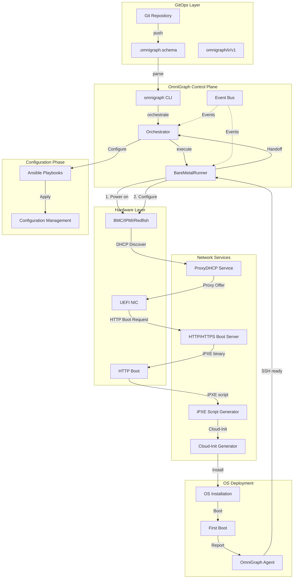
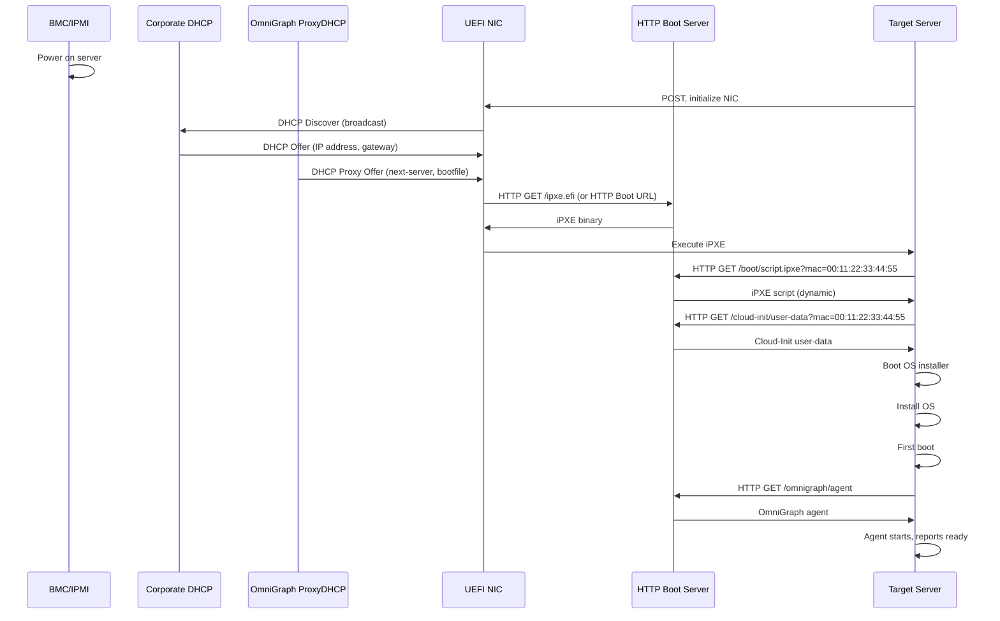

# Native Bare-Metal Provisioning Engine

## Overview

The Native Bare-Metal Provisioning Engine extends OmniGraph's capabilities to provision enterprise-grade hardware from a powered-off state to a fully configured OS. This engine integrates seamlessly with the existing `omnigraph orchestrate` pipeline and maintains GitOps principles throughout the bare-metal lifecycle.

## High-Level Architecture



## Component Architecture

### 1. ProxyDHCP Service

The ProxyDHCP service listens for DHCP Discover broadcasts and injects boot parameters without managing IP leases. This allows integration with existing corporate DHCP infrastructure.

**Key Features:**
- Listens on UDP port 67 (DHCP)
- Responds only to DHCP Discover packets
- Injects `next-server` and `bootfile` options
- Supports MAC address filtering via OmniGraph inventory
- Does NOT assign IP addresses (proxy mode only)

**Implementation:**
```
internal/baremetal/proxydhcp/
├── server.go          # Main DHCP listener
├── handler.go         # DHCP packet handler
├── config.go          # Configuration management
├── lease.go           # Lease tracking (for logging only)
└── options.go         # DHCP option builders
```

### 2. HTTP/HTTPS Boot Server

Modern UEFI systems support HTTP/HTTPS boot natively. This server provides:
- iPXE binaries (for legacy systems)
- iPXE scripts (dynamic generation)
- Cloud-Init configs (user-data, meta-data)
- OS installation media (ISO, netboot images)

**Implementation:**
```
internal/serve/pxe/
├── server.go          # HTTP server for boot files
├── ipxe.go            # iPXE script generator
├── cloudinit.go       # Cloud-Init config generator
├── ignition.go        # CoreOS Ignition generator
├── assets.go          # Static asset serving
└── handlers.go        # HTTP request handlers
```

### 3. BareMetalRunner

Extends OmniGraph's execution matrix (Layer 3) to handle bare-metal provisioning lifecycle.

**Lifecycle Phases:**
1. **Discovery** - Identify hardware via BMC/IPMI/Redfish
2. **Firmware Update** - Update BIOS/BMC firmware
3. **RAID Configuration** - Configure storage arrays
4. **Network Configuration** - Set boot order, VLANs
5. **OS Deployment** - Trigger HTTP boot
6. **First Boot** - Wait for OS to be ready
7. **Handoff** - Transition to Ansible configuration

**Implementation:**
```
internal/baremetal/
├── runner.go          # BareMetalRunner implementation
├── lifecycle.go       # Lifecycle state machine
├── discovery.go       # Hardware discovery
├── firmware.go        # Firmware update logic
├── raid.go            # RAID configuration
├── network.go         # Network boot configuration
├── boot.go            # Boot orchestration
├── redfish.go         # Redfish API client
├── ipmi.go            # IPMI client
└── events.go          # Event definitions
```

### 4. Data Model Extensions

#### OmniGraph IR Extension

```yaml
apiVersion: omnigraph/ir/v1
kind: InfrastructureIntent
metadata:
  name: bare-metal-servers
spec:
  targets:
    - id: server-01
      type: baremetal
      labels:
        role: compute
        environment: production
      # Bare-metal specific fields
      baremetal:
        macAddress: "00:1A:2B:3C:4D:5E"
        bmc:
          type: redfish
          address: "192.168.1.100"
          credentials:
            secretRef: "vault:bmc/server-01"
        bootMode: http  # http, ipxe, pxe
        osProfile: ubuntu-22.04-server
        firmwarePolicy: latest
        raidConfiguration:
          level: raid1
          disks: [sda, sdb]
  
  components:
    - id: server-01-os
      componentType: omnigraph.baremetal.os
      config:
        hostname: server-01.example.com
        network:
          interfaces:
            - name: eno1
              dhcp: false
              ipAddress: 192.168.1.10/24
              gateway: 192.168.1.1
        storage:
          layout: lvm
          volumes:
            - name: root
              size: 50G
              mount: /
            - name: data
              size: 500G
              mount: /data
```

#### .omnigraph.schema Extension

```yaml
apiVersion: omnigraph/v1
kind: Schema
metadata:
  name: bare-metal-deployment
spec:
  targets:
    compute-servers:
      type: baremetal
      count: 3
      profile: production-compute
      bootMode: http
      osProfile: ubuntu-22.04-server
  
  profiles:
    production-compute:
      firmwarePolicy: latest
      raidConfiguration:
        level: raid1
      osConfig:
        packages:
          - docker.io
          - kubelet
        users:
          - name: ansible
            ssh_authorized_keys:
              - ssh-rsa AAAA...
  
  outputs:
    server_ips:
      value: ${targets.compute-servers.*.ipAddress}
    bmc_ips:
      value: ${targets.compute-servers.*.bmc.address}
```

## Execution Flow

### Step-by-Step Pipeline Execution

```
1. omnigraph pipeline run deploy-infrastructure
   │
   ├─► Phase 1: Validation
   │   - Parse .omnigraph.schema
   │   - Validate bare-metal target definitions
   │   - Check BMC credentials in Vault
   │   - Verify network boot configuration
   │
   ├─► Phase 2: Plan
   │   - Generate iPXE scripts for each target
   │   - Generate Cloud-Init configs
   │   - Calculate boot sequence
   │   - Create provisioning timeline
   │
   ├─► Phase 3: Pre-flight Checks
   │   - Verify BMC reachability
   │   - Check DHCP/ProxyDHCP configuration
   │   - Validate HTTP boot server readiness
   │   - Confirm OS image availability
   │
   ├─► Phase 4: Bare-Metal Provisioning
   │   │
   │   ├─► For each target (parallel):
   │   │   4.1 Power on via BMC (Redfish/IPMI)
   │   │   4.2 Configure boot order (HTTP first)
   │   │   4.3 Trigger reboot
   │   │   4.4 ProxyDHCP intercepts DHCP Discover
   │   │   4.5 Inject boot parameters (next-server, bootfile)
   │   │   4.6 UEFI HTTP Boot initiates
   │   │   4.7 iPXE binary loads from HTTP server
   │   │   4.8 iPXE script fetched (dynamic per MAC)
   │   │   4.9 OS installer boots
   │   │   4.10 Cloud-Init fetched (user-data, meta-data)
   │   │   4.11 OS installation begins
   │   │   4.12 First boot completes
   │   │   4.13 OmniGraph agent reports ready
   │   │
   │   └─► Wait for all targets (with timeout)
   │
   ├─► Phase 5: State Interception
   │   - Collect IP addresses from DHCP leases
   │   - Update inventory with new IPs
   │   - Generate Ansible inventory
   │   - Emit omnigraph/graph/v1 with new nodes
   │
   ├─► Phase 6: Configuration (Ansible)
   │   - Run ansible-playbook against new inventory
   │   - Apply configuration management
   │   - Install applications
   │   - Configure monitoring
   │
   └─► Phase 7: Verification
       - Health checks
       - Service validation
       - Update NetBox CMDB
       - Generate deployment report
```

## Network Boot Sequence



## Security Considerations

### 1. Network Isolation
- Provisioning network should be isolated (VLAN)
- Use HTTPS for boot server (TLS 1.3)
- Implement mutual TLS for BMC communication

### 2. Credential Management
- BMC credentials stored in Vault (not in schema)
- Use OIDC/JWT for authentication
- Rotate credentials after provisioning

### 3. Secure Boot
- Support UEFI Secure Boot
- Sign iPXE binaries
- Validate boot images with checksums

### 4. Audit Trail
- Log all provisioning events
- Track who initiated provisioning
- Record firmware versions applied

## Integration Points

### NetBox Integration
- Discover bare-metal targets from NetBox inventory
- Update NetBox with provisioning status
- Sync IP addresses post-provisioning

### Vault Integration
- Store BMC credentials securely
- Fetch credentials during provisioning
- Rotate credentials post-provisioning

### Ansible Integration
- Generate dynamic inventory from provisioned hosts
- Hand off to Ansible for configuration management
- Support Ansible Vault for secrets

### Monitoring Integration
- Zabbix host registration
- Prometheus metrics export
- Grafana dashboards for provisioning status

## Future Enhancements

1. **Multi-vendor Support**
   - Dell iDRAC
   - HPE iLO
   - Lenovo XClarity
   - Supermicro IPMI

2. **Advanced Features**
   - Bare-metal container hosts (Kubernetes nodes)
   - GPU provisioning for AI/ML workloads
   - Network appliance provisioning
   - Edge compute node management

3. **Automation**
   - Auto-scaling based on workload
   - Predictive hardware failure detection
   - Automated firmware updates
   - Compliance scanning

4. **Integration**
   - ServiceNow for change management
   - Jira for tracking
   - Slack/Teams notifications
   - PagerDuty alerts