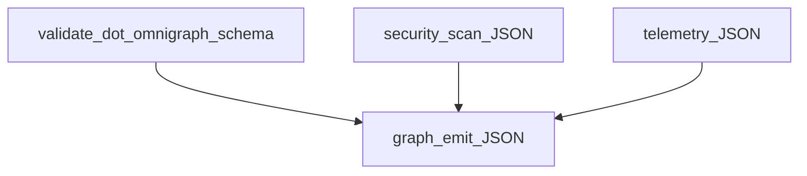

# CLI and CI automation

This page documents **headless and scripted** use of the **`omnigraph`** binary: validation, policy, graph emission, security scans, orchestration, and `serve`. It is the **automation path** that **feeds** the web workspace and CI—not the main product pitch; for the interactive graph UI, start with [using-the-web.md](using-the-web.md) and [README.md](../README.md).

These scenarios use the real CLI and files under [`testdata/`](../testdata/). Run commands from the **repository root** after building the binary ([local-dev.md](development/local-dev.md)).

**Prerequisites:** Go 1.23+, Node.js 20+ (only if you also run the web app), Git.

**Build once:**

```bash
go build -o bin/omnigraph ./cmd/omnigraph
```

Windows PowerShell:

```powershell
go build -o bin\omnigraph.exe .\cmd\omnigraph
```

Replace `./bin/omnigraph` with `.\bin\omnigraph.exe` below on Windows.

## How artifacts chain together



- **Validate** proves the project document matches the JSON Schema (and optionally runs policy).
- **`graph emit`** produces `omnigraph/graph/v1` for the **Topology** tab, CI, or other consumers, optionally folding in telemetry and security documents.

## Scenario 1: Validate schema only

**Goal.** Fail fast on invalid `.omnigraph.schema` before any tool runs.

```bash
./bin/omnigraph validate testdata/sample.omnigraph.schema
```

## Scenario 2: Validate with policy-as-code

**Goal.** Run Rego policies packaged as `omnigraph/policy/v1` policy sets against the same document (warn by default; fail with `--enforce` when violations use `deny` enforcement).

```bash
./bin/omnigraph validate testdata/sample.omnigraph.schema --policy-dir testdata/policies
```

Strict gate for CI-style exits:

```bash
./bin/omnigraph validate testdata/sample.omnigraph.schema --policy-dir testdata/policies --enforce
```

Example policy sources: [`testdata/policies/security-baseline.yaml`](../testdata/policies/security-baseline.yaml) (embedded Rego blocks).

## Scenario 3: Emit graph JSON for UI or CI

**Goal.** Produce `omnigraph/graph/v1` on stdout, enriched with sample telemetry and security payloads (paste into the **Topology** view or save as an artifact).

```bash
./bin/omnigraph graph emit testdata/sample.omnigraph.schema \
  --telemetry-file testdata/sample.telemetry.json \
  --security-file testdata/sample.security.json
```

Redirect when you need a file:

```bash
./bin/omnigraph graph emit testdata/sample.omnigraph.schema \
  --telemetry-file testdata/sample.telemetry.json \
  --security-file testdata/sample.security.json > graph.json
```

Optional inputs (when you have them): `--plan-json` (terraform/tofu show -json plan), `--tfstate` (JSON state path).

## Scenario 4: Passive security posture scan

**Goal.** Run read-only, ATT&CK-aligned modules and write `omnigraph/security/v1` JSON for merging into graphs or offline review.

Use **only** on systems you own or are explicitly authorized to test. The CLI spells this out in `omnigraph security --help`.

Local machine (writes a single file; pick any writable path):

```bash
./bin/omnigraph security scan --local --output ./local-scan.json
```

List available modules:

```bash
./bin/omnigraph security list-modules
```

Inventory-driven SSH (one JSON per host under an output directory):

```bash
./bin/omnigraph security scan \
  --inventory /path/to/hosts.ini \
  --ssh-user admin \
  --ssh-key ~/.ssh/id_rsa \
  --ssh-known-hosts ~/.ssh/known_hosts \
  --output-dir ./scans
```

## Scenario 5: Orchestrated plan, approval, apply, Ansible

**Goal.** Run the chained pipeline: validation, OpenTofu/Terraform plan, projected inventory, `ansible-playbook --check`, human approval (unless `--auto-approve`), apply, then live Ansible.

**You need a real workspace**: an OpenTofu/Terraform root (`--workdir`), a `.omnigraph.schema` (default name or override `--schema`), and a playbook path unless `--skip-ansible`. There is no single ready-made workspace under `testdata/` for this command; use your own IaC repo.

```bash
./bin/omnigraph orchestrate \
  --workdir /path/to/your/tf/root \
  --playbook ansible/site.yml
```

Container isolation (Docker or Podman):

```bash
./bin/omnigraph orchestrate \
  --workdir /path/to/your/tf/root \
  --playbook ansible/site.yml \
  --runner container
```

**Secrets:** pass credentials only via environment variables—no committed secrets in schema. See [ADR 003: memory-only secrets](core-concepts/adr/003-memory-only-secrets.md).

**Limits today:** `--iac-engine=pulumi` is not implemented; use `tofu` (default) or run Pulumi yourself via your runner strategy ([execution-matrix.md](core-concepts/execution-matrix.md)).

Alias: `omnigraph pipeline` is the same as `orchestrate`.

## Scenario 6: HTTP API and optional bundled UI

**Goal.** Expose repository scan and workspace summary APIs locally; optionally serve a built web app.

**Defaults:** listens on loopback (`127.0.0.1:38671`). Treat any non-loopback bind as requiring strong authentication and network controls.

Minimal API-only:

```bash
./bin/omnigraph serve
```

With static UI (after `cd packages/web && npm run build`):

```bash
./bin/omnigraph serve --web-dist packages/web/dist
```


Experimental endpoints (`POST /api/v1/security/scan`, inventory, host-ops, etc.) stay **off** unless you pass the matching `--enable-*` flags **and** `--auth-token` (or set `OMNIGRAPH_SERVE_TOKEN`). Read `omnigraph serve --help` before enabling them.

## End-to-end (E2E) suite

The **`e2e/`** harness drives the **built CLI** against **simulated Ansible endpoints** and **fixture IR/graph/state**, including **failure injection** (non-zero exits, timeouts, malformed responses). It complements package-scoped `go test` by proving the **whole pipeline** under stress.

```bash
go test ./e2e/...
```

Details, philosophy, and when to add a scenario: [E2E testing](development/e2e-testing.md).

## Where to go next

- [Using the web workspace](using-the-web.md)
- [Overview](overview.md)
- [Security posture](security/posture.md)
- [Execution matrix](core-concepts/execution-matrix.md)
- [E2E testing](development/e2e-testing.md)
