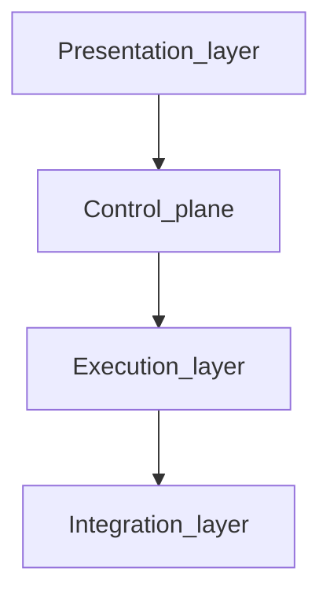

# Architecture Overview

The **presentation layer** (React web workspace in `packages/web`) is the **primary human interface**: users explore `omnigraph/graph/v1` and related context interactively. The Go control plane and workspace server validate intent, aggregate discovery, and **emit or refresh** the artifacts that layer consumes—alongside **`go test`** and CI use cases.

OmniGraph separates infrastructure intent, orchestration, and runtime execution into
clear layers so teams can integrate their own providers and delivery workflows.

## Layers

1. Presentation layer: web UI and developer-facing validation feedback
2. Control plane: workspace server, graph emit, and orchestration libraries in Go
3. Execution layer: host and container runners for external tools
4. Integration layer: inventory, telemetry, identity, and policy adapters

Each layer consumes the one below: the UI and validation UX sit on the Go control plane; orchestration drives runners; runners and hooks talk to inventory, telemetry, identity, and policy integrations.

## Key Design Principles

- Schema-first contracts before imperative execution
- Tool-agnostic orchestration rather than tool replacement
- Versioned data formats (`omnigraph/*/v1`) for compatibility
- Explicit boundaries between core behavior and environment-specific examples

## Repository layout (workspaces)

The **presentation layer** ships as an **isolated npm package** under **`packages/web`**. The **Go control plane**, **Wasm tool modules** (`wasm/*`), and shared libraries are wired together with a root **`go.work`** file so backend module graphs stay independent of Node—`go work sync` keeps the workspace coherent, and a Go refactor cannot accidentally rewrite frontend lockfiles.

For the full narrative—**Emitter Engine**, **Wasm hardening**, and the **`e2e/`** harness—read [Platform architecture for contributors](../development/platform-architecture.md).

## Related Docs

- [UX architecture](ux-architecture.md) (progressive disclosure, SSE-backed truth, contextual debugging)
- [Understanding the UI modes](../guides/ui-modes.md)
- [Overview](../overview.md) (who / what / where)
- [Using the web workspace](../using-the-web.md)
- [Platform architecture for contributors](../development/platform-architecture.md)
- `omnigraph-ir.md`
- [Emitter Engine](emitter-engine.md)
- `state-management.md`
- `execution-matrix.md`
- [Reference architectures overview](../reference-architectures/overview.md)
