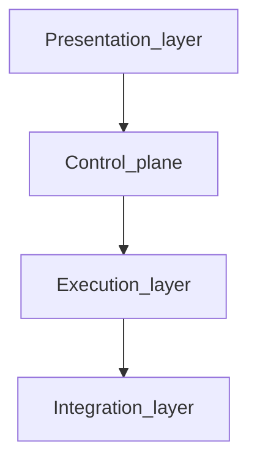

# Architecture Overview

The **presentation layer** (React web workspace in `web/`) is the **primary human interface**: users explore `omnigraph/graph/v1` and related context interactively. The Go control plane, CLI, and runners exist to validate intent, run optional pipelines, and **emit or refresh** the artifacts that layer consumes—alongside headless CI use cases.

OmniGraph separates infrastructure intent, orchestration, and runtime execution into
clear layers so teams can integrate their own providers and delivery workflows.

## Layers

1. Presentation layer: web UI and developer-facing validation feedback
2. Control plane: CLI and orchestration logic in Go
3. Execution layer: host and container runners for external tools
4. Integration layer: inventory, telemetry, identity, and policy adapters

Each layer consumes the one below: the UI and validation UX sit on the Go control plane; orchestration drives runners; runners and hooks talk to inventory, telemetry, identity, and policy integrations.

## Key Design Principles

- Schema-first contracts before imperative execution
- Tool-agnostic orchestration rather than tool replacement
- Versioned data formats (`omnigraph/*/v1`) for compatibility
- Explicit boundaries between core behavior and environment-specific examples

## Related Docs

- [Overview](../overview.md) (who / what / where)
- [Using the web workspace](../using-the-web.md)
- `omnigraph-ir.md`
- `state-management.md`
- `execution-matrix.md`
- [Reference architectures overview](../reference-architectures/overview.md)
