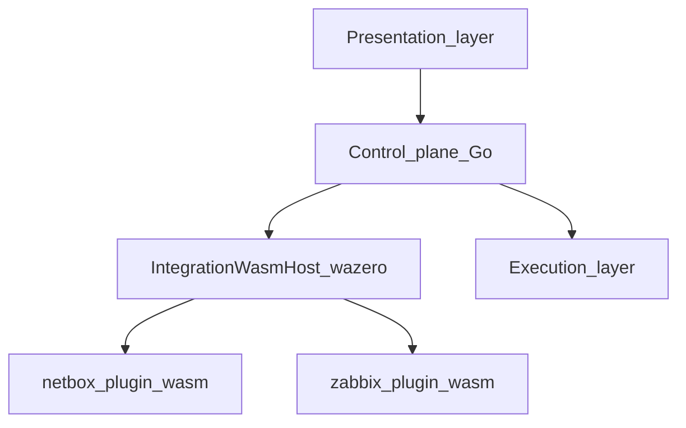

# Architecture Overview

The **presentation layer** (React web workspace in `packages/web`) is the **primary human interface**: users explore `omnigraph/graph/v1` and related context interactively. The Go control plane and workspace server validate intent, aggregate discovery, and **emit or refresh** the artifacts that layer consumes—alongside **`go test`** and CI use cases.

OmniGraph separates infrastructure intent, orchestration, and runtime execution into clear layers. **External system integrations** (CMDB, monitoring, IPAM, etc.) are not implemented as native HTTP clients inside business logic: they run as **WASM micro-containers** behind a single **host-mediated HTTP** capability (see below).

## Layers

1. Presentation layer: web UI and developer-facing validation feedback
2. Control plane: workspace server, graph emit, orchestration libraries in Go, and the **integration WASM host** ([`internal/runner`](../../internal/runner))
3. Execution layer: host and container runners for external tools (OpenTofu, Ansible, etc.)
4. Integration surface: **WASI modules** for inventory/telemetry-style pulls, invoked only through the control plane—**no ad hoc `net/http` to vendor APIs in core packages**

Each layer consumes the one below for orchestration: the UI sits on the Go control plane; orchestration drives runners. **Integration plugins** are siblings to that path: the host loads a `.wasm` guest, passes **`omnigraph/integration-run/v1`** on stdin, and validates **`omnigraph/integration-result/v1`** (and nested **`omnigraph/inventory-source/v1`**) on stdout.

## Integration micro-containers (backend WASM)

**Definition:** A *micro-container* here is one **WASI module instance** plus a **minimal capability surface**: stdin/stdout, bounded output size, and **only** the host function `omnigraph.http_fetch`, which performs HTTP **after** URL/method checks against operator configuration. Guests do not receive raw sockets, the host filesystem, or ambient credentials except what the operator places in the stdin envelope (still supplied by the host process).

**Blast radius:** Faulty or malicious plugin code cannot open arbitrary network destinations (prefix allowlist per run), cannot read arbitrary host files (unchanged from parser plugins), and cannot exceed configured stdout/HTTP body limits.

**Lifecycle:** Stateless, one-shot: stdin carries the run envelope; stdout carries a single JSON result. Operators invoke plugins via **`omnigraph integration-run --wasm=…`** ([`cmd/omnigraph`](../../cmd/omnigraph)) or, when enabled, **`POST /api/v1/integrations/run`** on the workspace server ([`internal/serve`](../../internal/serve)).

**Parser vs integration plugins:** *Parser* plugins ([`RunWASIParser`](../../internal/runner/wasiparser.go)) are **stdio-only** and emit **`omnigraph/graph/v1`**. *Integration* plugins ([`RunIntegrationPlugin`](../../internal/runner/integration_host.go)) may trigger **allowlisted** HTTP through the host import. Do not conflate them with **browser** Wasm (HCL diagnostics in `packages/web`), which is a separate trust and ABI surface (see [ADR 008](adr/008-wasm-bridge-hardening.md)).

## Key Design Principles

- Schema-first contracts before imperative execution
- Tool-agnostic orchestration rather than tool replacement
- Versioned data formats (`omnigraph/*/v1`) for compatibility
- Explicit boundaries between core behavior and environment-specific examples
- **No native “integration SDKs” in core** for external vendor APIs—those APIs live inside WASM guests

## Repository layout (workspaces)

The **presentation layer** ships as an **isolated npm package** under **`packages/web`**. The **Go control plane**, **Wasm tool modules** (`wasm/*`), and shared libraries are wired together with a root **`go.work`** file so backend module graphs stay independent of Node—`go work sync` keeps the workspace coherent, and a Go refactor cannot accidentally rewrite frontend lockfiles.

For the full narrative—**Emitter Engine**, **Wasm hardening**, and the **`e2e/`** harness—read [Platform architecture for contributors](../development/platform-architecture.md).

## Related Docs

- [Backend Wasm plugins (parsers + integrations)](../development/wasm-plugins.md)
- [Integrations](integrations.md)
- [Inventory sources](inventory-sources.md)
- [IR contracts reference](../schemas/ir-contracts.md)
- [UX architecture](ux-architecture.md) (progressive disclosure, SSE-backed truth, contextual debugging)
- [Understanding the UI modes](../guides/ui-modes.md)
- [Overview](../overview.md) (who / what / where)
- [Using the web workspace](../using-the-web.md)
- [Platform architecture for contributors](../development/platform-architecture.md)
- `omnigraph-ir.md`
- [Emitter Engine](emitter-engine.md)
- `state-management.md`
- `execution-matrix.md`
- [Reference architectures overview](../reference-architectures/overview.md)
