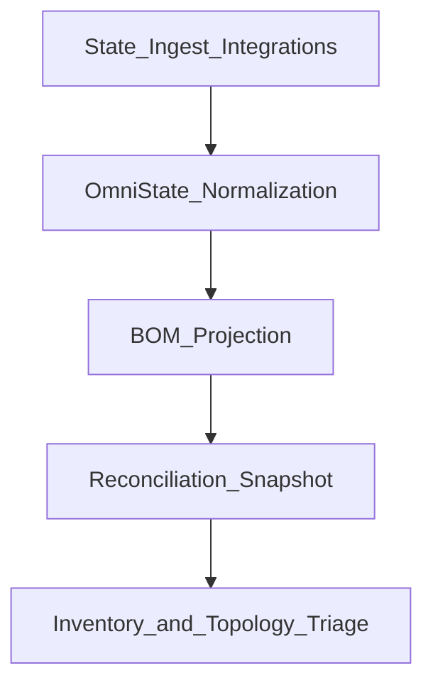

# BOM Automation

**You are here:** this page explains how OmniGraph automates software, hardware, and service bill-of-materials evidence for reconciliation decisions in the web workspace.
**Next decision:** if you are defining contract payloads, start with the schemas; if you are triaging drift, start with Reconciliation mode in the UI.

## Mental model

OmniGraph builds a reconciliation-ready view in three steps:

1. Normalize evidence (state, ingest, integrations) into control-plane state.
2. Project normalized state into a BOM document (`omnigraph/bom/v1`).
3. Join BOM + drift into a reconciliation snapshot (`omnigraph/reconciliation-snapshot/v1`) for Inventory and Topology triage.

## Contracts (schema-first)

- BOM document schema: [`schemas/omnigraph.bom.v1.schema.json`](../../schemas/omnigraph.bom.v1.schema.json)
- Reconciliation snapshot schema: [`schemas/omnigraph.reconciliation-snapshot.v1.schema.json`](../../schemas/omnigraph.reconciliation-snapshot.v1.schema.json)
- Runtime normalized state: [`internal/omnistate/types.go`](../../internal/omnistate/types.go)

## Operator-facing outcomes

- Inventory can show BOM entity/relation totals plus drift cues from one snapshot payload.
- Topology can use dependency semantics and reconciliation counters without re-deriving backend truth in the browser.
- Drift language stays local and actionable (`missing_dependency`, `stale_dependency`, `confidence_drop`).

## Related pages

- [Architecture](architecture.md)
- [Inventory sources](inventory-sources.md)
- [Understanding the UI modes](../guides/ui-modes.md)
