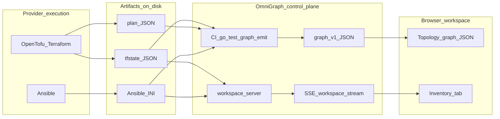

# Data handoff: provider execution to web workspace

This page maps how **raw execution-layer artifacts** relate to what you **see** in the OmniGraph workspace during reconciliation or an incident. It is a **technical deep-dive**; for a short first session in the UI only, start with [Getting started](../getting-started.md).

## Purpose

OmniGraph does not replace OpenTofu, Terraform, or Ansible. It **coordinates visibility**: normalized summaries, graph JSON, and browser views. Understanding the handoff avoids expecting magic parsing (for example, turning every Ansible traceback into new graph nodes automatically).

## End-to-end flow

Typical paths:

1. **CI / `go test` emit path** — Automated checks run the same graph emit logic used in the product: a **Project** document (`.omnigraph.schema`, TOML/YAML/JSON) plus optional tfstate, plan JSON, telemetry, and security payloads. Output is **`omnigraph/graph/v1` JSON** for Topology or saved artifacts.
2. **Same-origin workspace server** — The local server discovers state and inventory paths, **watches** files (with debounce), and pushes **`workspace_summary`** events on **`GET /api/v1/workspace/stream`** (SSE). The **Inventory** tab consumes that stream so counts and paths refresh without pasting each time.
3. **Manual paste** — You can still paste **state JSON**, **plan JSON**, or **INI** into Inventory when the server is not in the loop.

Implementation touchpoints: [`internal/serve/workspace_watch.go`](../../internal/serve/workspace_watch.go) (watch + SSE), [`docs/using-the-web.md`](../using-the-web.md) (tab behavior).

## Raw input vs visual output (illustrative)

These snippets are **representative**, not a guarantee of every field the UI shows.

| Raw input (messy / machine) | What you see in the workspace |
|----------------------------|--------------------------------|
| OpenTofu **plan JSON** fragment: `"resource_changes": [ { "address": "aws_instance.app", "change": { "actions": ["update"] } } ]` (illustrative) | After **emit**, graph nodes such as **`planned-*`** vertices and edges from tooling; **Inventory** may show derived host keys when your emit pipeline maps plan/state to inventory. |
| **Terraform state** JSON: large `resources` array with nested `instances` | **Topology** shows **`live-*`** (or equivalent) nodes when graph JSON is emitted with state; **Inspector** shows **label**, **state**, **attributes** (for example `ansible_host`). |
| Ansible **stderr** line: `fatal: [web-1]: UNREACHABLE! ...` (illustrative) | OmniGraph **does not** automatically parse arbitrary playbook stderr into graph nodes today. You reconcile via **logs in your runner**, **Inventory** host status, or **graph** updates your pipeline emits. |
| **Drift** or policy log line in CI (plain text) | Not ingested as structured topology unless your automation **emits** or **updates** `omnigraph/graph/v1` or workspace summary inputs. |

## Honest boundaries

- **Structured wins** — State JSON, plan JSON, and validated graph JSON have stable shapes the tools can rely on.
- **Unstructured logs** — Require explicit pipelines (emit, telemetry bundles, or future features) to become canvas nodes; do not assume the web app infers topology from free text alone.
- **Incident loop** — During an incident you often: refresh **Inventory** (SSE or paste), compare to **Topology**, and use **Triage mode** on the selected node. That is **assisted** triage, not automatic root-cause attribution.

## See also

- [UX architecture](ux-architecture.md) — progressive disclosure, backend truth
- [CI and contributor automation](../ci-and-contributor-automation.md)
- [Graph dependencies and blast radius](../guides/graph-dependencies-and-blast-radius.md)
