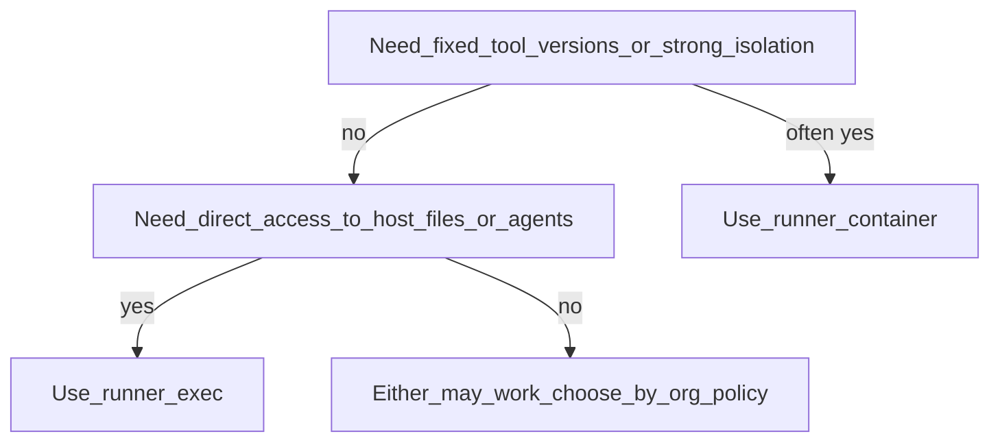

# Execution Matrix

Runners and orchestration steps exist to **execute** OpenTofu/Terraform, Ansible, and related tools safely—and to **produce and refresh** plan output, state, inventory, and **`omnigraph/graph/v1`** (and related) artifacts that the **web workspace** and CI consumers display. This page is about *how* that execution is wired, not a substitute for the graph-first story in [using-the-web.md](../using-the-web.md).

OmniGraph orchestrates external tools through pluggable runners.

## Runner Types

- `exec`: runs tools directly on the host
- `container`: runs tools in containerized environments

## Choosing a runner (trade-offs)

There is no universal “right” choice; pick based on policy, reproducibility, and what is installed on the host.



- **`exec`:** simpler on machines that already have `tofu`/`terraform`, Ansible, and SSH keys; closer to how many engineers run tools today; security posture depends entirely on that host.
- **`container`:** more reproducible tool versions when you pin images (`--tofu-image`, `--ansible-image`); shifts trust to the container runtime and image supply chain.

## Orchestration pipeline (`orchestrate` / `pipeline`)

The `orchestrate` command implements a concrete chain: validate and coerce project intent, run plan, derive inventory inputs, run Ansible in check mode, gate on approval (unless `--auto-approve`), apply, then Ansible apply. Tool invocations go through the selected runner (`exec` vs `container`).

```mermaid
sequenceDiagram
  participant Actor as operator_or_CI
  participant OG as omnigraph_orchestrate
  participant R as runner_exec_or_container
  participant IaC as OpenTofu_Terraform_Ansible
  Actor->>OG: run_pipeline
  OG->>OG: validate_and_coerce
  OG->>R: tofu_plan
  R->>IaC: plan
  IaC-->>R: plan_artifact
  OG->>R: ansible_playbook_check
  R->>IaC: check_mode
  Actor->>OG: approve_or_auto_approve
  OG->>R: tofu_apply
  R->>IaC: apply
  OG->>R: ansible_playbook_apply
  R->>IaC: apply_mode
```

## Typical Pipeline Shape

1. Validate schema and intent artifacts
2. Coerce/prepare tool-specific inputs
3. Run planning steps
4. Run apply and post-apply workflows
5. Emit graph/run/security artifacts

## Compatibility Guidance

Execution strategy should be selected per environment constraints (security policy,
tool availability, reproducibility requirements). No single runner is required.

## Related Docs

- [Overview](../overview.md)
- [Using the web workspace](../using-the-web.md)
- [CLI and CI](../cli-and-ci.md) (command examples)
- [Architecture](architecture.md)
