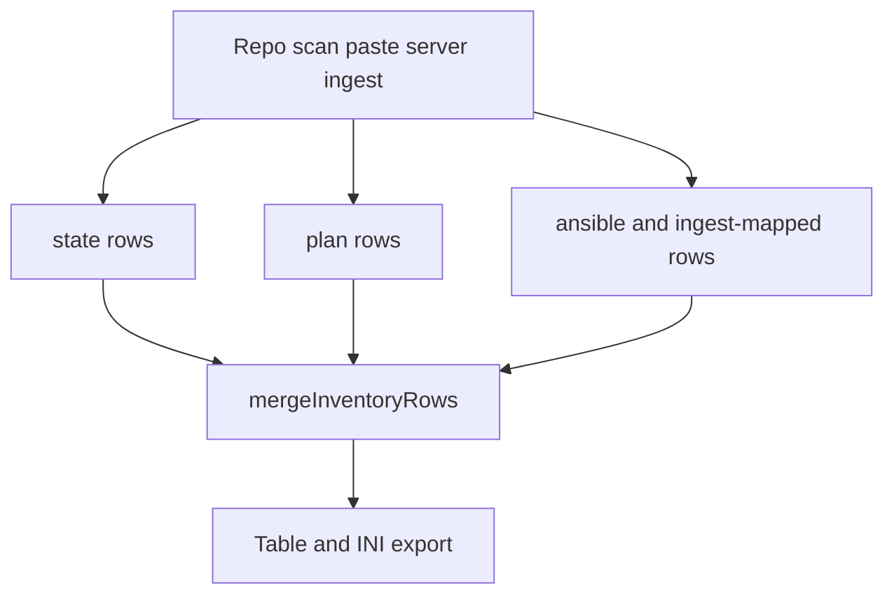

# Inventory Sources

OmniGraph can aggregate inventory context from multiple sources to support planning, graph generation, and post-apply operations.

## Normalized contract

Machine validation uses **`omnigraph/inventory-source/v1`** ([`schemas/inventory-source.v1.schema.json`](../../schemas/inventory-source.v1.schema.json)). Snapshots declare `metadata.source` (for example `netbox`, `zabbix`, `merged`) and `spec.records[]` with stable ids, record types, and optional cross-source `links`.

## How snapshots are produced today

**NetBox** and **Zabbix** inventory-style pulls are implemented as **WASM integration micro-containers** under [`wasm/plugins/`](../../wasm/plugins/): each plugin calls its vendor API **only** via the host **`http_fetch`** import (allowlisted URLs). The workspace server and other Go packages **do not** call NetBox or Zabbix HTTP APIs directly.

Produce **`.wasm`** artifacts and run them through the **workspace server**: enable **`--enable-integration-run-api`** (with authentication configured like other privileged APIs) and use **`POST /api/v1/integrations/run`**. The request carries the same logical shape as the **`omnigraph/integration-run/v1`** envelope the host passes on **stdin** to the guest: credentials and **`allowedFetchPrefixes`** must match host configuration for that invocation.

Contributor-only build and stdin/stdout checks for plugins live in **[Contributor commands](../development/contributor-commands.md)**; they are **not** the primary operator path.

## Common inputs (other sources)

- IaC state outputs
- Static or generated inventory files
- CMDB/device APIs (prefer mapping into **`inventory-source/v1`** via WASM integrations)
- Runtime telemetry snapshots

## Browser workspace: how Inventory rows combine

**You are here:** the **Inventory** tab is part of **Reconciliation** mode—see [Understanding the UI modes](../guides/ui-modes.md) for how it sits next to **Topology** (declared graph) and **Pipeline** (execution context).

The table lists hosts from several channels at once; the **merged** list is built in [`packages/web/src/mvp/buildInventoryViewModel.ts`](../../packages/web/src/mvp/buildInventoryViewModel.ts): **Terraform/OpenTofu state-shaped rows** (repo scan files, paste overrides, control-plane **workspace summary**, and **ingest**-mapped TF resources), then **plan JSON**, then **Ansible INI** (repo files, paste, plus ingest-mapped Ansible hosts). **Exported INI** (`[omnigraph]`) dedupes by normalized host **name**—the **first** row in that concatenation wins for `ansible_host`, so state-derived lines take precedence over plan, then Ansible/ingest, when names collide.

For day-to-day use of the tabs (Topology triage versus Inventory evidence), start from [Using the web workspace](../using-the-web.md).

## Contract reference

Use versioned schema contracts from `schemas/` for machine validation and exchange. Keep source-specific field mappings in environment documentation when they are not part of the shared schema.

For cross-domain dependency automation, BOM and reconciliation projections are defined separately from raw inventory snapshots:

- [`schemas/omnigraph.bom.v1.schema.json`](../../schemas/omnigraph.bom.v1.schema.json)
- [`schemas/omnigraph.reconciliation-snapshot.v1.schema.json`](../../schemas/omnigraph.reconciliation-snapshot.v1.schema.json)

When incident focus narrows, load reconciliation snapshot context first (BOM entity/edge totals + drift cues), then drill into raw source rows only for confirmation.
