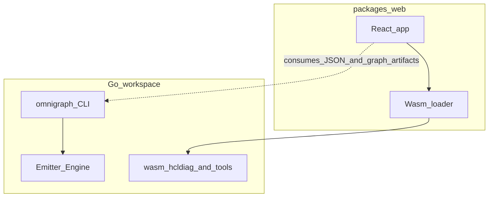
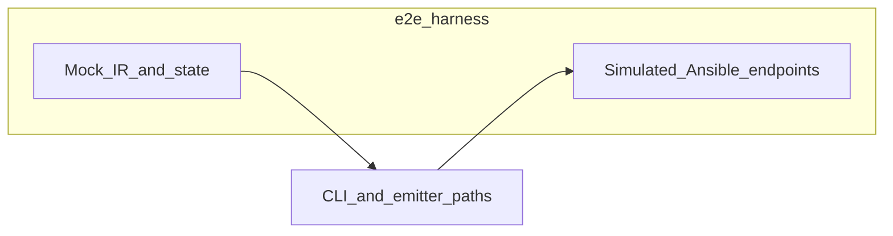

# Platform architecture for contributors

OmniGraph is easier to extend when you see it as a **living ecosystem** of contracts, translators, and surfaces—not a single lump of code. This guide walks through **why** the repository was reshaped, **what** each pillar does, and **where** to plug in safely. It complements the shorter [architecture overview](../core-concepts/architecture.md) with narrative depth; use the glossary below when terminology overlaps.

## Glossary: emitter vs manifest reconciliation vs orchestration

| Term | Meaning |
|------|--------|
| **Emitter Engine** | The **translation layer** that turns declarative **`omnigraph/ir/v1`** intent into **concrete execution artifacts** (Ansible inventory today; more backends over time). First-class, documented, and extended through Go interfaces. See [Emitter Engine](../core-concepts/emitter-engine.md). |
| **Manifest reconciliation** | A **Kubernetes-style loop**: desired resources in a manifest versus actual provider state, driven by `omnigraph apply` and `internal/reconcile`. See [Declarative reconciliation (reference)](../reference-architectures/declarative-reconciliation.md). |
| **Orchestration** | **Chained execution** of external tools (OpenTofu plan/apply, inventory projection, Ansible check/apply) in [`internal/orchestrate`](../../internal/orchestrate/). It **consumes** workspaces and state; it is not the same as IR emission. |

Keeping these distinct reserves **reconcile** for desired-vs-actual manifest control and avoids overloading it with IR compilation.

## The problem we left behind

For a long time the repository felt **flat and coupled**: the Go control plane—schemas, CLI, orchestration, graph emission—sat beside the TypeScript workspace as if they shared one fate. In practice the Go tree dominated the line count (roughly **seven parts Go to two parts TypeScript** in application sources—re-verify with `cloc` after large refactors; see footnote below), and **every** backend change risked rippling into **frontend install and build** assumptions. Deep under `internal/`, the logic that turns declarative IR into Ansible-shaped outputs was **easy to miss** if you were not already inside the core team. New contributors had to infer boundaries instead of reading them.

**Footnote — reproducible language mix:** from the repository root, with [cloc](https://github.com/AlDanial/cloc) installed: `cloc --exclude-dir=node_modules,dist,.git,.cursor wasm packages/web cmd internal pkg schemas e2e`. Typical output centers near **~72% Go** and **~24% TypeScript**; YAML/JSON schemas and documentation make up the rest.

## The resolution in four moves

We **decoupled** repositories-within-the-repo using **Go workspaces**, **isolated** the web application as its own package, **elevated** the Emitter Engine as a first-class architectural actor, **hardened** the WebAssembly bridge against hostile input, and **proved** the full pipeline under stress with a dedicated **E2E** harness. Each move has a dedicated deep dive; here they form one story.

### 1. Workspaces and an isolated frontend

The **root `go.work`** file lists every Go module that belongs to the platform: the main module (`./`), Wasm toolchains under `wasm/*`, and any shared libraries (for example under `pkg/`). Running `go work sync` keeps the workspace graph coherent. **Node does not participate in Go module resolution**, and a refactor in the CLI cannot silently change how npm resolves the UI.

The **React application** lives in **`packages/web`**: its own `package.json`, lockfile, and scripts. The repository root orchestrates CI and ships artifacts, but **day-to-day frontend work** happens entirely inside that package. Wasm binaries still build from Go modules under `wasm/` and land in static paths the UI loads at runtime.

### 2. Emitter Engine as the visible heart

Declarative graph state—**`omnigraph/ir/v1`**—is the handoff between “what we intend” and “what runners can execute.” The **Emitter Engine** is the subsystem that **materializes** that intent: today, for example, **Ansible INI inventory** from targets; tomorrow, additional formats registered in one place. Developers extend it by implementing small **backend** types and registering them; failures return as ordinary **`error`** values, not opaque crashes. The full contract and extension story live in [Emitter Engine](../core-concepts/emitter-engine.md).

### 3. WebAssembly boundary safety

The browser loads **Go-built Wasm** for fast HCL diagnostics and related linters. Historically, **malformed or pathological payloads** crossing the JS–Go boundary could surface as **panics inside Wasm** or **invalid JSON** on the return path—either way, the **tab** suffered more than a single panel should. We treat the bridge as a **security-adjacent surface**: defensive parsing, **consistent JSON envelopes**, **no panics** on user-controlled paths, and **fuzzing** (`go test -fuzz`) over the Go entry points that marshal responses. The TypeScript side wraps calls so a failure **degrades** to a visible diagnostic instead of unwinding the whole workspace. See [ADR 008: Wasm bridge hardening](../core-concepts/adr/008-wasm-bridge-hardening.md) and [Security posture — client-side execution](../security/posture.md#webassembly-and-client-side-execution).

### 4. End-to-end testing under duress

Unit and package tests catch regressions in isolation; they do not always catch **real-world failure modes**—Ansible returning non-zero, slow endpoints, malformed HTTP bodies. The **`e2e/`** suite spins up **simulated Ansible-facing endpoints** and **mock IR/graph/state fixtures**, then drives the **full pipeline** so we observe behavior when things go wrong, not only when they succeed. When to add an E2E case versus a unit test, and how to run the harness locally and in CI, is spelled out in [E2E testing](e2e-testing.md).

## Where to read next

| Topic | Document |
|--------|-----------|
| Emitter Engine interfaces and registration | [emitter-engine.md](../core-concepts/emitter-engine.md) |
| Wasm hardening and fuzzing | [ADR 008](../core-concepts/adr/008-wasm-bridge-hardening.md), [wasm/README.md](../../wasm/README.md) |
| E2E layout and philosophy | [e2e-testing.md](e2e-testing.md) |
| Clone, build, test commands | [CONTRIBUTING.md](../../CONTRIBUTING.md), [local-dev.md](local-dev.md) |
| Layer diagram (short form) | [architecture.md](../core-concepts/architecture.md) |

You now have a single thread from **repository shape** to **translation** to **browser safety** to **pipeline proof**. Follow the links when you are ready to change code; each page is written to reward that next step.

## Architectural code map

High-level paths in the monorepo (moved from the root README so the default reader stays product-focused).

| Path | Role in the product |
|------|---------------------|
| [`cmd/omnigraph`](../../cmd/omnigraph) | CLI entry → [`internal/cli`](../../internal/cli) (validate, `graph emit`, `serve`, `orchestrate`, …). |
| [`internal/`](../../internal/) | Go control plane: graph emission, HTTP **`serve`** (SSE, optional ingest/sync), orchestration, policy, [`internal/state`](../../internal/state) parsing, repo discovery, [`internal/omnistate`](../../internal/omnistate) normalization. |
| [`packages/web`](../../packages/web) | React workspace: Topology, Inventory, SSE client [`useWorkspaceSummaryStream.ts`](../../packages/web/src/mvp/useWorkspaceSummaryStream.ts). |
| [`schemas/`](../../schemas/) | JSON Schema sources for versioned contracts. |
| [`wasm/`](../../wasm/) | Browser Wasm ([`wasm/hcldiag`](../../wasm/hcldiag)) plus optional **WASI** parser plugins under [`wasm/plugins/`](../../wasm/plugins/) ([`internal/runner`](../../internal/runner)). |
| [`e2e/`](../../e2e/) | Contributor end-to-end harness. |
| [`pkg/emitter`](../../pkg/emitter) | **IR → artifacts** (Emitter Engine): [`model.go`](../../pkg/emitter/model.go) carries `omnigraph/ir/v1`-shaped intent; backends compile into Ansible-oriented output. Manifest reconciliation lives in `internal/reconcile` / `omnigraph apply`. |

**Live workspace stream (SSE):** `GET /api/v1/workspace/stream` — discovery-backed summaries with **fsnotify** debouncing when state or inventory files change; see [`internal/serve/server.go`](../../internal/serve/server.go).

### Codebase tour: artifacts ↔ schema

| Product artifact | Where it is defined |
|------------------|---------------------|
| `omnigraph/graph/v1` (Topology JSON) | [`schemas/graph.v1.schema.json`](../../schemas/graph.v1.schema.json) |
| `.omnigraph.schema` (`Project`) | [`schemas/omnigraph.schema.json`](../../schemas/omnigraph.schema.json) |
| IR-shaped intent | [`schemas/ir.v1.schema.json`](../../schemas/ir.v1.schema.json) + [`pkg/emitter`](../../pkg/emitter) |
