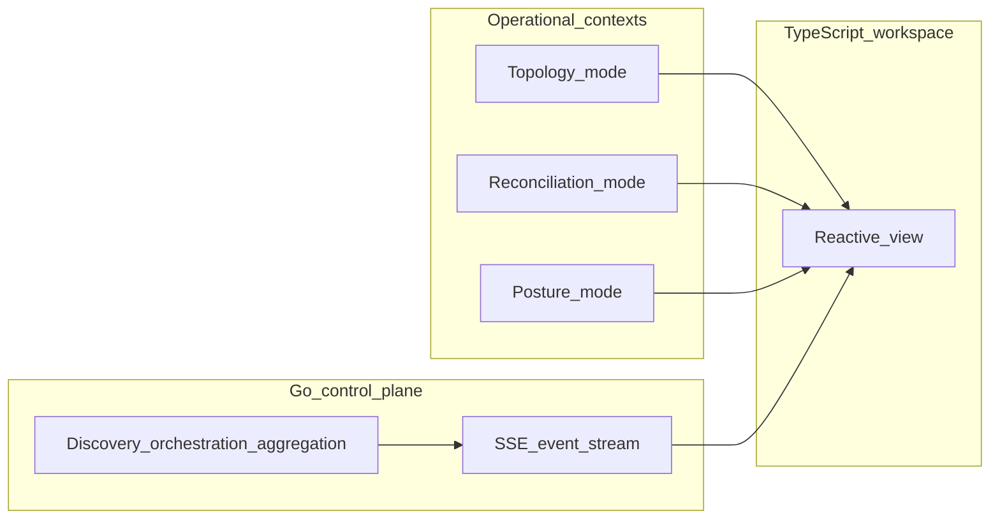

# Understanding the UI modes

The OmniGraph workspace is organized into **three operational contexts**—**Topology**, **Reconciliation**, and **Posture**—so you are not forced to read everything at once. Each mode answers a different question; together they replace the cluttered “pilot’s dashboard” pattern with **progressive disclosure**: depth appears when your focus (and your graph selection) asks for it.

Conceptual background: [UX architecture: disclosure, truth, and context](../core-concepts/ux-architecture.md). Tab names and layout today: [Using the web workspace](../using-the-web.md).

## How modes relate to the backend and the canvas

The **Go control plane** performs heavy work; the **TypeScript** workspace **reflects** authoritative results. Live updates for control-plane-backed views are intended to flow through **Server-Sent Events** so the UI does not assume success before the backend confirms it.

## Sidebar mapping (today)

The sidebar groups **Topology**, **Reconciliation** (Inventory + Pipeline), **Posture**, then **Supporting editors**. Persisted tab ids (`visualizer`, `inventory`, …) are unchanged for workspace storage compatibility.

| Mode | Question it answers | Sidebar tabs (current labels) | Primary artifacts / actions |
|------|---------------------|-------------------------------|-----------------------------|
| **Topology** | What exists in the declared model, and how is it wired? | **Topology** (tab id `visualizer`) | Edit or paste `omnigraph/graph/v1` JSON; explore the interactive graph; **Inspector** includes optional `attributes.debugLog` ([`GraphVisualizerTab`](../../packages/web/src/mvp/GraphVisualizerTab.tsx)). |
| **Reconciliation** | Does reality match what we declared? | **Inventory**, **Pipeline** | Paste Terraform/OpenTofu **state** and **plan JSON**, Ansible **INI**; optional repo scan; **`omnigraph serve`** summary and **SSE** `GET /api/v1/workspace/stream` ([`InventoryTab`](../../packages/web/src/mvp/InventoryTab.tsx), [`PipelineTab`](../../packages/web/src/mvp/PipelineTab.tsx)). |
| **Posture** | How risky or non-compliant is this shape? | **Posture** | Edit `omnigraph/security/v1` JSON; align with graph emit and policy workflows ([`PostureTab`](../../packages/web/src/mvp/PostureTab.tsx)); see also [Security posture](../security/posture.md). |

## Topology mode

**Purpose:** See the system as a **graph of intent and relationships**—resources, edges, phases, and labels—without drowning in operational lists.

**What you do here:** Open and edit `omnigraph/graph/v1`, pan the canvas, and **select nodes** to drive the Inspector. This mode privileges **structure over telemetry**: the graph answers “what is wired to what?” and “where does this object sit in the declared architecture?”

**Why it feels lighter:** Global lists and non-critical metrics stay out of the way until you switch to reconciliation or posture. Selection-scoped detail keeps the right pane **about the node**, not about the entire estate.

### When an incident narrows the story (alert-shaped focus, today)

The workspace does **not** need a live paging integration to respect **incident-shaped** attention. Today this shows up as:

- **Triage mode** — Opens the unified panel (reconciliation-shaped lines, posture refs, drift-shaped cues) **for the selected node id**, without turning the whole canvas into a dashboard.
- **Observation drill (external trigger)** — Practice **MTTR-style** focus by changing **lab** infrastructure **outside** the UI (script, local mock, or throwaway Terraform/OpenTofu apply) while **Topology** and **Inventory** update through **ingest** and **SSE**. OmniGraph coordinates visibility; it does not execute the outage from a workspace button. See [Getting started — observation drill](../getting-started.md).

Edge **`dependencyRole`** (`necessary` vs `sufficient`) defines what counts for blast-radius math in tooling and the web; see [Graph dependencies and blast radius](graph-dependencies-and-blast-radius.md).

### Day-1 developer rhythm (non-crisis)

- **Pre-merge** — Load emitted **`omnigraph/graph/v1`** next to your code review and scan **structural deltas** (new nodes/edges, `dependencyRole` changes).
- **Speculative topology** — Prefer graphs that distinguish **`planned-*`** vs **`live-*`** resources so reviewers see **intent before apply**.
- **Architecture minutes** — Re-read **Topology** and a **workspace summary** on a quiet day to **reconcile** your mental model with the declared graph before an incident forces the same work under pressure.

## Reconciliation mode

**Purpose:** Answer **“does the world match what we declared?”** using evidence from Terraform/OpenTofu state and plan artifacts, Ansible inventory, and pipeline/orchestration context.

**What you do here:** Bring in **state JSON**, **plan JSON**, and **inventory** inputs; use **Pipeline** to see how orchestration maps to your repo; when `omnigraph serve` is available, pull **workspace summary** or rely on the **SSE** stream for recurring `workspace_summary` events.

**Why it matters:** Reconciliation is where declarative models meet **mutable reality**. Keeping it in its own context prevents the topology view from becoming a dumping ground for every operational artifact.

## Posture mode

**Purpose:** Judge **risk and compliance posture** as first-class graph and document context—security overlays, policy alignment, and the `omnigraph/security/v1` shape that can merge into how you read the system.

**What you do here:** Edit or review posture JSON, align it with schema and graph emit workflows, and treat security as **a lens** rather than a bolt-on report.

**Why it is separate:** Posture questions (“what is exposed?”, “what violates policy?”) are different cognitive work than topology or drift. A dedicated mode avoids smuggling severity chrome into every other screen.

## Supporting editors (not modes)

**Schema Contract** and **Web IDE** support every mode: they are where you **edit the contracts and HCL** that feed the graph and runners. They do not replace the three modes; they **supply** them with validated intent.

## See also

- [Graph dependencies and blast radius](graph-dependencies-and-blast-radius.md)
- [NOC / SRE workflow](workflows-noc-sre.md) · [SOC / SecOps workflow](workflows-soc-secops.md)
- [Using the web workspace](../using-the-web.md)
- [Overview](../overview.md)
- [Architecture](../core-concepts/architecture.md)
