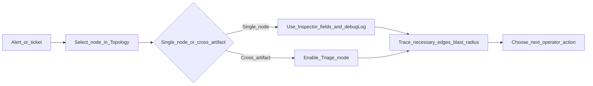

# Workflow: NOC / SRE (reconciliation and MTTR)

This guide is for operators who live in **incidents**, **runbooks**, and **time-to-restore** metrics. OmniGraph is a **browser-based local workspace** for **shared understanding** of intent and evidence—not a replacement for your provider or CI system.

**You are here:** `docs/guides` -> workflow guide -> **NOC/SRE reconciliation path**.
**Next decision:** start from Topology node selection (single-system incident) or enable Triage mode (multi-artifact incident).

## What to use in the workspace

| Goal | Mode / area | Why |
|------|-------------|-----|
| See declared wiring and selection-driven detail | **Topology** | Keeps structure visible without dumping every list on screen |
| Compare models to state-shaped evidence | **Reconciliation** (Inventory, Pipeline) | Terraform/OpenTofu state, plan JSON, Ansible inventory |
| One place for hand-off, drift-shaped cues, posture refs | **Triage mode** (Topology) | Aggregates context **per selected node id** |

Progressive disclosure is the default: the canvas stays **light** until you **select** a node or **open triage**, then depth appears **next to** that focus—not as a wall of global metrics.

## Reducing MTTR (without pretending to be a pager)

1. **Anchor on the graph** — Select the node that matches the alert or ticket (host, broker, tool). Use the **Inspector** for id, kind, state, and optional `attributes.debugLog` slices mapped to that node.
2. **Turn on Triage mode** when the incident spans **multiple artifacts** — Reconciliation lines, posture references, and drift-shaped hints stay **scoped** to the same node id.
3. **Use blast-radius semantics** — Edges tagged **`necessary`** drive **primary** impact cones; **`sufficient`** edges stay contextual. See [Graph dependencies and blast radius](graph-dependencies-and-blast-radius.md).
4. **Practice with an observation drill** — With **Topology** open and **ingest/SSE** enabled, run a **lab-only** external change (see [Getting started](../getting-started.md) and [`examples/quickstart/break_network.sh`](../../examples/quickstart/break_network.sh)) and watch the canvas and summaries update. Use **Triage mode** on the affected node when you want the focused panel.

## Honest boundaries

OmniGraph **coordinates visibility and handoff** between people and tools. It does **not** replace Terraform, OpenTofu, Ansible, or your observability backend. Live truth for repo-backed summaries still flows from the **Go control plane** (e.g. SSE) when your deployment enables it—see [Using the web workspace](../using-the-web.md).

## See also

- [UI modes](ui-modes.md)
- [UX architecture: disclosure, truth, and context](../core-concepts/ux-architecture.md)
