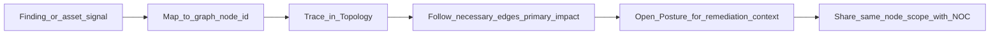

# Workflow: SOC / SecOps (posture and exposure tracing)

Security teams care about **exposure paths**, **control coverage**, and **evidence**—not a second CMDB that duplicates scanners. OmniGraph supports **posture as a lens** on the same **topology** operators use for incidents.

**You are here:** `docs/guides` -> workflow guide -> **SOC/SecOps exposure path**.
**Next decision:** begin from a finding-linked node id in Topology, then determine primary impact via necessary edges.

## What to use in the workspace

| Goal | Mode / area | Why |
|------|-------------|-----|
| Risk and policy overlays | **Posture** | Edit or review `omnigraph/security/v1` JSON alongside the graph narrative |
| Structural “how is this wired?” | **Topology** | Trace **edges** and **enclaves** (`attributes.enclave` / trust zones) before jumping to raw findings |
| Incident-style correlation | **Triage mode** | When enabled, keeps reconciliation and posture references **node-scoped** |

## Tracing “security blast radius”

1. Start from a **finding** or **asset** tied to a **graph node id** (or label you can map to a node).
2. In **Topology**, follow **necessary** edges for **primary** dependency impact—optional or contextual links use **`sufficient`**. See [Graph dependencies and blast radius](graph-dependencies-and-blast-radius.md).
3. In **Posture**, align **severity** and **remediation** text with the same mental model the NOC sees on the canvas—reducing translation errors between teams.

## Honest boundaries

OmniGraph **does not replace** vulnerability scanners, CSPM, or IAM analysis tools. It helps teams **see** how declared infrastructure **connects** and **where posture documents attach** to that structure. For posture schema detail, see [Security posture](../security/posture.md).

## See also

- [UI modes](ui-modes.md)
- [Getting started](../getting-started.md) — includes the **observation drill** (external lab trigger + live workspace sync)
