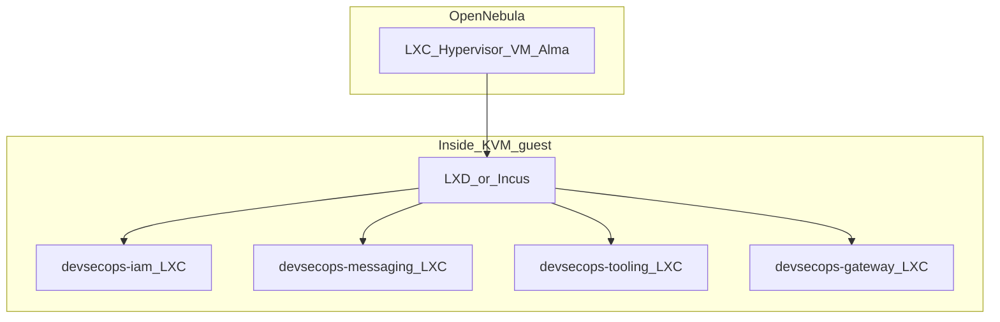

# AlmaLinux 10 LXC decomposition on OpenNebula

**Goal:** Run **multiple AlmaLinux 10 system containers (LXC)** on an **OpenNebula KVM guest** with **LXD/Incus**. **Prefer native systemd services or Podman** inside each LXC; treat **Docker Compose** as a **transitional** path that matches [`lxd_devsecops_stack`](../../ansible/roles/lxd_devsecops_stack/defaults/main.yml) today. See **[REDUCE-DOCKER.md](REDUCE-DOCKER.md)** for what to run without Docker and how to drop `docker-ce`.

## Why this fits OpenNebula

| Flat Docker on one big VM | Alma 10 LXC per stack (**native/Podman preferred**, Docker optional) |
|-----------------------------|----------------------------------------|
| Single blast radius; harder live-migrate chunks | **Per-stack** start/stop, snapshot, and capacity tuning |
| One OS patch window for everything | Patch **guest** LXCs in waves; hypervisor stays slim |
| Nested Docker = DinD cgroup noise | **No Docker daemon** when tier A/B in [REDUCE-DOCKER.md](REDUCE-DOCKER.md) |
| Drifts from repo `devsecops_*` instance model | Same **instance names** as Ansible (`devsecops-iam`, …) |
| Network | **LXD bridge + NAT** first; evolve to **macvlan/veth** per [VLAN_MATRIX](../../deployments/opennebula-kvm/VLAN_MATRIX.md) / VR |

The **image** is already pinned to **`almalinux/10`** in role defaults (`lxd_image: "images:almalinux/10"`).

## Canonical decomposition (from Ansible)

**Target end state:** each LXC runs **systemd-native** (or **Podman**) workloads; the **compose file** column is the **current** automation reference.

Instance names and (transitional) compose projects — [`ansible/roles/lxd_devsecops_stack/defaults/main.yml`](../../ansible/roles/lxd_devsecops_stack/defaults/main.yml):

| LXC instance (`lxd_apply_names`) | Compose inside LXC | Docker networks (logical) |
|----------------------------------|--------------------|-----------------------------|
| `devsecops-iam` | `docker-compose.iam.yml` | `iam_net` (100.64.20.0/24) |
| `devsecops-messaging` | `docker-compose.messaging.yml` (or `.slim`) | `msg_backbone_net` (100.64.10.0/24) |
| `devsecops-dev` | `iam` + `messaging.slim` (single nested Docker) | IAM + slim messaging nets |
| `devsecops-tooling` | `docker-compose.tooling.yml` | **`gitea_net`**, `n8n_net`, `zammad_net`, … |
| `devsecops-chatops` | `docker-compose.chatops.yml` | `chatops_net` |
| `devsecops-telemetry` | `docker-compose.telemetry.yml` | `telemetry_net` (+ deps) |
| `devsecops-gateway` | `single-pane-of-glass/docker-compose.yml` | **`gateway_net`** (100.64.5.0/24) |

**Optional stacks** (discovery, LLM, SIEM, etc.) stay **additional** compose files; add matching LXC definitions to the role or run a **second** `docker compose` project inside an ops LXC (extend role when satisfied locally).

## OpenNebula topology (recommended)



1. **Single OpenNebula VM** (vCPU/RAM sized for full lab): OS **AlmaLinux 10**, install **Incus** or **LXD**. Use [`docker-nesting`](../../deployments/local-lxc/profiles/docker-nesting.yaml) **only** for LXCs that still run Docker/Podman; skip for **native-only** LXCs ([REDUCE-DOCKER.md](REDUCE-DOCKER.md)).
2. **Attach NICs** so the guest can reach **`devsecops-edge`** (192.168.86.0/24) and/or **trunk** the VLANs you need toward [VLAN_MATRIX.md](../../deployments/opennebula-kvm/VLAN_MATRIX.md) segments.
3. From your **Ansible controller**, target **`lxd_hosts`** = that VM (SSH), not `localhost` — see [Inventory example](#inventory-example-opennebula-lxd-host).
4. Run [`deploy-devsecops-lxc.yml`](../../ansible/playbooks/deploy-devsecops-lxc.yml) with `lxd_apply_names` listing the instances you want (start with `iam`, `messaging`, then `tooling`, `gateway`, …).

**Smaller edge:** use **`devsecops-dev`** + **`devsecops-tooling`** + **`devsecops-gateway`** only; enable full messaging later.

## Networking: LXC egress vs `100.64` parity

**Native/Podman LXC:** bind services to **LXC interfaces** or loopback + reverse proxy; assign **Routed `100.64.x` addresses** via extra vNIC/macvlan when ready — same VR/ISR model as [NETWORK_DESIGN.md](../NETWORK_DESIGN.md).

**Docker-in-LXC (legacy):** Docker **bridge networks** inside the LXC mimic compose subnets; upstream routing still happens at the **OpenNebula VR/ISR**.

**Phases:**

1. **Bootstrap:** LXD default bridge + NAT (role: `lxd_ensure_managed_bridge`) so LXCs have DNS; **Podman**/`dnf` pulls do not require Docker.
2. **Production-like:** Attach **additional vNICs** on the OpenNebula VM to **`devsecops-iam`**, **`devsecops-gateway`**, etc. VNETs; configure **LXD `macvlan` / `bridged` devices** so **selected** LXCs get addresses on the **real** `100.64.x` segments (advanced — document with your IPAM). Until then, **one** upstream path via edge + static routes may be enough for a homelab.

Document the chosen mapping in your runbook; do not assume LXD autoconfigures VLANs without explicit devices.

## Provisioning steps (summary)

1. **OpenNebula:** create AlmaLinux 10 template; instantiate **LXD host** VM; vNIC on **`devsecops-edge`** or management net.
2. **Guest:** `dnf update`; install **Incus** (or LXD); apply **docker-nesting** profile only where needed — [`bootstrap-lxd-profile.sh`](../../deployments/local-lxc/scripts/bootstrap-lxd-profile.sh). For **native-only** fleet, skip Docker install in instances: `-e lxd_install_docker_in_instance=false`.
3. **Controller:** `ansible-galaxy collection install -r ansible/collections/requirements.yml`
4. **Playbook:**  
   `ansible-playbook -i inventory/opennebula-lxd.yml ansible/playbooks/deploy-devsecops-lxc.yml \`  
   `  -e 'lxd_apply_names=["devsecops-iam","devsecops-messaging","devsecops-tooling","devsecops-chatops","devsecops-gateway"]' \`  
   `  -K`  
   Optionally `-e devsecops_lxc_compose_up=true` after [secrets-bootstrap](../../scripts/secrets-bootstrap.sh) inside each LXC (or inject Vault env per [devsecops_containers](../../ansible/roles/devsecops_containers/README.md) patterns).

5. **Secrets:** Same **Vault KV** model — run bootstrap from a jump host or copy `secret/devsecops` after IAM LXC is up.

## Inventory example (OpenNebula LXD host)

Create e.g. `ansible/inventory/opennebula-lxd.example.yml` locally (copy, do not commit secrets):

```yaml
all:
  children:
    lxd_hosts:
      hosts:
        on-lxd-01:
          ansible_host: 192.168.86.50   # example: VM on devsecops-edge
          ansible_user: alma
          ansible_become: true
```

Run the play **from** a machine that can SSH to `on-lxd-01`; LXC CLI runs **on** that host.

## Migrating from flat Docker

**If you are already moving to tier A/B in [REDUCE-DOCKER.md](REDUCE-DOCKER.md):** restore **application data** to host paths (Postgres datadir, Gitea `data/`, Vault raft, etc.) and start **systemd units or Podman Quadlets** instead of restoring into `/var/lib/docker`.

**Compose-in-LXC (transitional):**

1. For each **logical stack** (IAM, messaging, tooling, …), **stop** compose on the old host and **backup Docker volumes** (see [CONTAINER-LIFT-TO-OPENNEBULA.md](CONTAINER-LIFT-TO-OPENNEBULA.md)).
2. **Provision** the matching **`devsecops-*`** LXC (with **`lxd_install_docker_in_instance: true`** only if you still need Docker there).
3. **Restore** volume data into that LXC’s Docker (`/var/lib/docker/volumes/...` or `docker run` restore pattern).
4. **Start** `docker compose up -d` inside the LXC (or `-e devsecops_lxc_compose_up=true` once volumes are in place).

## Keycloak IAM as code (after IAM LXC is routable)

From `ansible/`, once the public/gateway URL for Keycloak works from your controller:

```bash
ansible-playbook -i inventory/opennebula-lxd.yml playbooks/keycloak-iam.yml \
  -e @path/to/devsecops_secrets.vault.yml \
  -e keycloak_iam_target_hosts=localhost -e ansible_connection=local \
  -e keycloak_iam_public_url=https://your-gateway.example/auth
```

Adjust `keycloak_iam_public_url` to match Traefik/gateway path (`KEYCLOAK_PUBLIC_URL` / secrets).

## Related

- **Minimize Docker:** [REDUCE-DOCKER.md](REDUCE-DOCKER.md)
- Local LXC canonical doc: [`deployments/local-lxc/README.md`](../../deployments/local-lxc/README.md)
- Container / volume moves (remaining OCI stacks): [CONTAINER-LIFT-TO-OPENNEBULA.md](CONTAINER-LIFT-TO-OPENNEBULA.md)
- VLAN / VR: [VLAN_MATRIX.md](../../deployments/opennebula-kvm/VLAN_MATRIX.md)
