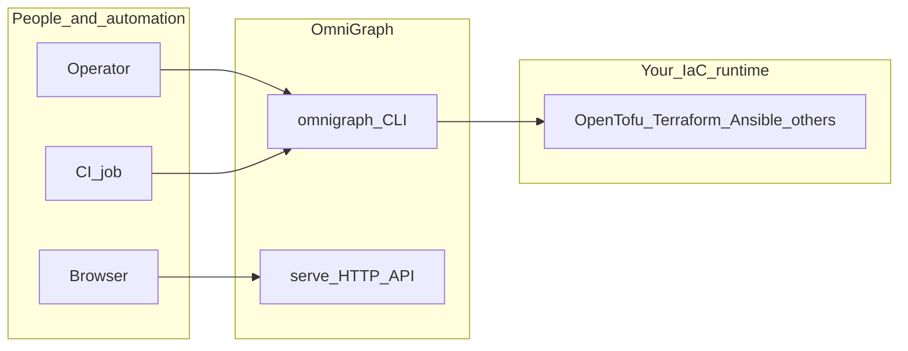
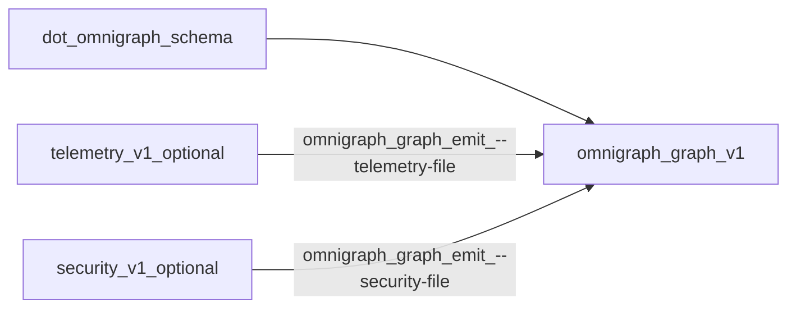

# Overview

This page orients you in one pass: **who** typically uses OmniGraph, **what** it does (and does not do), **where** the important pieces live in the repository, and how major artifacts relate.

## Who this is for

- **Platform / IaC engineers** chaining validation, OpenTofu or Terraform plans, and Ansible apply in a repeatable pipeline.
- **Operators and SRE** who need graph and run visibility without standardizing on a single vendor UI.
- **Security and compliance reviewers** who want policy checks on intent documents and optional passive posture scans that feed the same graph model.
- **Contributors** extending the Go control plane, schemas, or the React UI.

OmniGraph is not a replacement for Terraform, OpenTofu, Ansible, or your cloud APIs. It sits **above** those tools: contracts, orchestration gates, and emitted artifacts.

## What OmniGraph does

- **Schema-first project documents** (`.omnigraph.schema` and related JSON Schema) validated before execution.
- **CLI orchestration** for plan → check → approve → apply → post-apply patterns, with pluggable **host (`exec`) or container** runners.
- **Versioned artifacts** such as `omnigraph/graph/v1` for visualization and CI, optionally merged with `omnigraph/telemetry/v1` and `omnigraph/security/v1` payloads.
- **Optional HTTP API** (`omnigraph serve`) for repository/workspace discovery and the built web UI when you point `--web-dist` at a production build.
- **Policy-as-code hooks** (Rego embedded in policy sets) during `validate` and dedicated `policy` subcommands.

Stub or experimental areas are called out in [journeys.md](journeys.md) and in CLI help (for example `--iac-engine=pulumi` on `orchestrate`).

## System context

The diagram below is logical, not a deployment diagram: it shows who touches which entrypoints and that external IaC tools remain yours to operate.

## Artifact relationships

A common path: validate a project document, emit a graph for the UI or pipelines, and enrich it with telemetry and security scans produced separately.

- **IR YAML** (`omnigraph/ir/v1`) describes infrastructure intent for validation and emission workflows; see [omnigraph-ir.md](core-concepts/omnigraph-ir.md). Example: [`testdata/sample.ir.v1.yaml`](../testdata/sample.ir.v1.yaml).
- Example telemetry and security JSON under [`testdata/`](../testdata/) mirror the shapes merged by `graph emit`.

## Where things live in the repo

| Path | Role |
|------|------|
| [`cmd/`](../cmd/), [`internal/`](../internal/) | CLI implementation, orchestration, graph/security/policy engines |
| [`schemas/`](../schemas/) | Versioned JSON Schema and contract sources |
| [`docs/`](../docs/) | Canonical documentation (this tree) |
| [`web/`](../web/) | React frontend |
| [`wasm/`](../wasm/) | WASM modules used by UI or runtime helpers |
| [`testdata/`](../testdata/) | Small fixtures for validation, policies, and examples |

## Related reading

- [Journeys (hands-on)](journeys.md)
- [Architecture (layers)](core-concepts/architecture.md)
- [Execution matrix](core-concepts/execution-matrix.md)
- [Security posture](security/posture.md)
- [Documentation hub](README.md)
