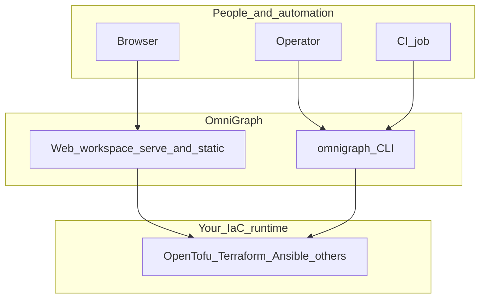
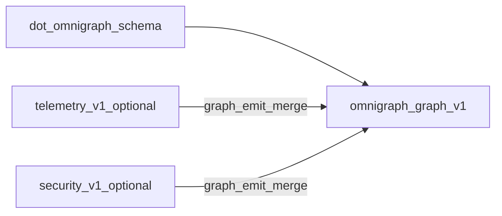

# Overview

This page orients you in one pass: **who** typically uses OmniGraph, **what** it does (and does not do), **where** the important pieces live in the repository, and how major artifacts relate.

## Who this is for

- **Operators, reviewers, and platform engineers** who want **graph-level visibility** into intent, topology, pipeline context, and posture without living in raw logs.
- **Teams standardizing on a shared workspace** (React UI + optional `omnigraph serve`) for exploration before or alongside automation.
- **Automation owners** who still need a solid **CLI** for CI, scans, and orchestration—the binary **feeds** the same graph artifacts the UI displays.
- **Contributors** extending the web app, schemas, or Go control plane.

OmniGraph is not a replacement for Terraform, OpenTofu, Ansible, or your cloud APIs. It sits **above** those tools: contracts, visibility, orchestration when you want it, and emitted artifacts for the workspace. Read [product-philosophy.md](product-philosophy.md) for positioning.

## What OmniGraph does

- **Interactive web workspace** ([`packages/web`](../packages/web)): Visualizer (graph JSON), schema validation, pipeline command builder, inventory and server-backed summary, posture JSON, optional WASM HCL IDE—see [using-the-web.md](using-the-web.md).
- **Versioned graph artifacts** (`omnigraph/graph/v1`) merged with optional `omnigraph/telemetry/v1` and `omnigraph/security/v1` for what you **see** in the UI and in CI consumers.
- **HTTP API** (`omnigraph serve`) for repository/workspace discovery and serving the built UI with `--web-dist`.
- **Schema-first project documents** (`.omnigraph.schema` and related JSON Schema) validated in the UI and CLI.
- **Policy-as-code** (Rego in policy sets) during `validate` and `policy` subcommands—results inform gates and can align with workspace context.
- **CLI orchestration** for plan → check → approve → apply → post-apply when you need headless pipelines; pluggable **host (`exec`) or container** runners. Documented in [cli-and-ci.md](cli-and-ci.md).

Stub or experimental areas are called out in [cli-and-ci.md](cli-and-ci.md) and in CLI help (for example `--iac-engine=pulumi` on `orchestrate`).

## System context

The diagram below is logical: the **browser** is the primary human entry for exploration; **CLI** and **CI** are parallel paths for automation. Both consume or produce the same contracts and artifacts.

## Artifact relationships

A common path: validate a project document, emit a graph for the **Visualizer** or pipelines, and enrich it with telemetry and security scans produced separately.

- **IR YAML** (`omnigraph/ir/v1`) describes infrastructure intent for validation and emission workflows; see [omnigraph-ir.md](core-concepts/omnigraph-ir.md). Example: [`testdata/sample.ir.v1.yaml`](../testdata/sample.ir.v1.yaml).
- Example telemetry and security JSON under [`testdata/`](../testdata/) mirror the shapes merged by `graph emit`.

## Where things live in the repo

| Path | Role |
|------|------|
| [`packages/web`](../packages/web) | React workspace (graph, schema, pipeline, inventory, posture). |
| [`wasm/`](../wasm/) | WASM used by the UI. |
| [`cmd/`](../cmd/), [`internal/`](../internal/) | CLI and control plane (orchestration, graph emit, serve, policy, security). |
| [`schemas/`](../schemas/) | Versioned JSON Schema and contract sources. |
| [`docs/`](../docs/) | Canonical documentation (this tree). |
| [`testdata/`](../testdata/) | Fixtures for validation, policies, sample graph/telemetry/security. |

## Related reading

- [Using the web workspace](using-the-web.md)
- [CLI and CI](cli-and-ci.md)
- [Architecture (layers)](core-concepts/architecture.md)
- [Execution matrix](core-concepts/execution-matrix.md)
- [Security posture](security/posture.md)
- [Documentation hub](README.md)
